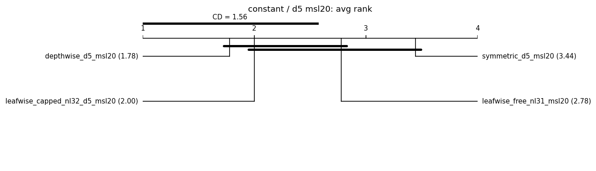
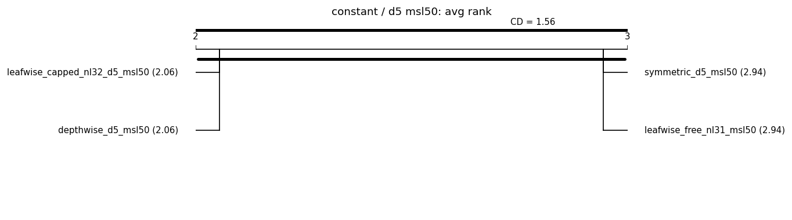
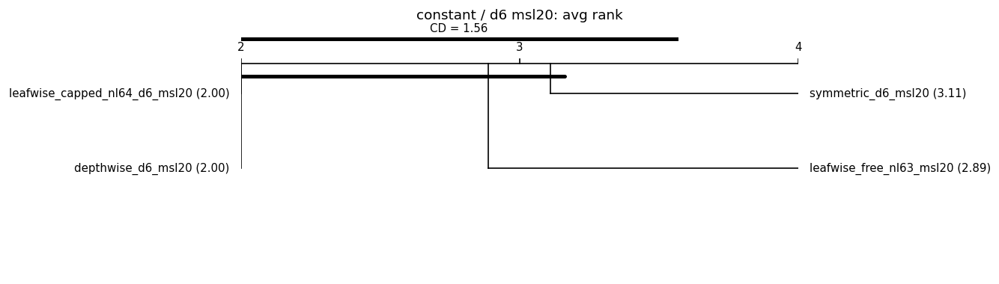
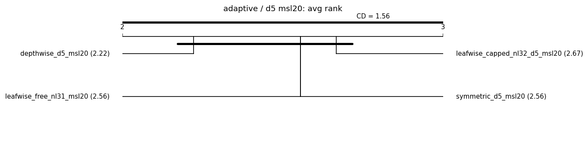
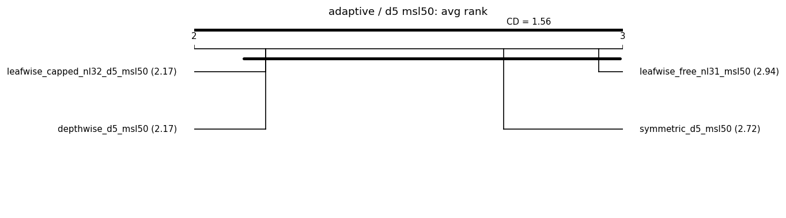
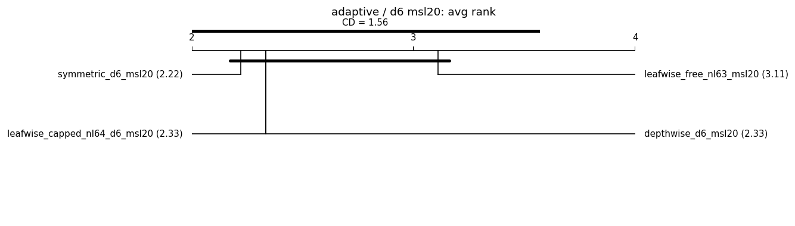

# grow_policy on real data — Phase 33 default-change gate

Auto-generated by `experiments/grow_policy_real_data.py`. Compares `grow_policy in {leafwise, depthwise, symmetric}` x `leaf_model in {constant, adaptive}` (identity encoder) on the 9 legacy OpenML-suite datasets under a capacity-match sensitivity sweep (see the module docstring). Primary metric: RMSE (regression) / logloss (classification), lower is better; mean ± std over seeds.

**Decision rule (fixed before the run):** change the default only if symmetric or depthwise beats **both** capacity-matched leaf-wise shapes (free + capped) on a **majority of datasets by >=1σ** (paired per-seed deltas, sample std), across the capacity regimes. The keep/change/null verdict itself is written by results-analyst, not this script.

## Reproducibility manifest

- run_id: 20260708T042004Z; git: 8f49556 (dirty=True)
- python: 3.11.1 on macOS-26.5.1-arm64-arm-64bit
- OMP_NUM_THREADS: 1
- packages: numpy=1.26.4, pandas=1.5.2, scipy=1.10.0, scikit-learn=1.9.0, repleafgbm=0.0.1, optuna=4.6.0, lightgbm=4.6.0, xgboost=3.2.0, catboost=1.2.10, matplotlib=3.6.2
- settings: seeds=[0, 1, 2, 3, 4], max_rows=6000, n_estimators=400 (lr=0.1, early stopping 25 rounds on the validation split), split 60/20/20 (stratified for classification), quick=False
- arms (estimator overrides):
  - `leafwise_free_nl31_msl20`: {'grow_policy': 'leafwise', 'num_leaves': 31, 'max_depth': -1, 'min_samples_leaf': 20}
  - `leafwise_capped_nl32_d5_msl20`: {'grow_policy': 'leafwise', 'num_leaves': 32, 'max_depth': 5, 'min_samples_leaf': 20}
  - `depthwise_d5_msl20`: {'grow_policy': 'depthwise', 'num_leaves': 31, 'max_depth': 5, 'min_samples_leaf': 20}
  - `symmetric_d5_msl20`: {'grow_policy': 'symmetric', 'num_leaves': 32, 'max_depth': 5, 'min_samples_leaf': 20}
  - `leafwise_free_nl31_msl50`: {'grow_policy': 'leafwise', 'num_leaves': 31, 'max_depth': -1, 'min_samples_leaf': 50}
  - `leafwise_capped_nl32_d5_msl50`: {'grow_policy': 'leafwise', 'num_leaves': 32, 'max_depth': 5, 'min_samples_leaf': 50}
  - `depthwise_d5_msl50`: {'grow_policy': 'depthwise', 'num_leaves': 31, 'max_depth': 5, 'min_samples_leaf': 50}
  - `symmetric_d5_msl50`: {'grow_policy': 'symmetric', 'num_leaves': 32, 'max_depth': 5, 'min_samples_leaf': 50}
  - `leafwise_free_nl63_msl20`: {'grow_policy': 'leafwise', 'num_leaves': 63, 'max_depth': -1, 'min_samples_leaf': 20}
  - `leafwise_capped_nl64_d6_msl20`: {'grow_policy': 'leafwise', 'num_leaves': 64, 'max_depth': 6, 'min_samples_leaf': 20}
  - `depthwise_d6_msl20`: {'grow_policy': 'depthwise', 'num_leaves': 63, 'max_depth': 6, 'min_samples_leaf': 20}
  - `symmetric_d6_msl20`: {'grow_policy': 'symmetric', 'num_leaves': 64, 'max_depth': 6, 'min_samples_leaf': 20}

## adult (binary, n=6000, categorical: 8)

### leaf_model = constant

| arm | logloss (mean ± std) | auc | fit[s] | best_it | Δ vs LW-free | Δ vs LW-capped |
|---|---|---|---|---|---|---|
| leafwise_capped_nl32_d5_msl20 | 0.3162 ± 0.0072 | 0.9047 | 0.1 | 70 | - | - |
| depthwise_d5_msl20 | 0.3162 ± 0.0072 | 0.9047 | 0.1 | 70 | **-0.0064 (1.1σ)** | +0.0000 (0.0σ) |
| leafwise_capped_nl64_d6_msl20 | 0.3171 ± 0.0065 | 0.9041 | 0.1 | 60 | - | - |
| depthwise_d6_msl20 | 0.3171 ± 0.0065 | 0.9041 | 0.1 | 60 | **-0.0122 (1.3σ)** | +0.0000 (0.0σ) |
| leafwise_capped_nl32_d5_msl50 | 0.3182 ± 0.0072 | 0.9037 | 0.1 | 60 | - | - |
| depthwise_d5_msl50 | 0.3182 ± 0.0072 | 0.9037 | 0.1 | 60 | **-0.0075 (1.6σ)** | +0.0000 (0.0σ) |
| leafwise_free_nl31_msl20 | 0.3226 ± 0.0037 | 0.9015 | 0.1 | 43 | - | - |
| symmetric_d5_msl50 | 0.3238 ± 0.0059 | 0.8998 | 0.2 | 221 | -0.0020 (0.5σ) | **+0.0055 (1.7σ)** |
| symmetric_d5_msl20 | 0.3253 ± 0.0063 | 0.8984 | 0.3 | 192 | +0.0027 (0.3σ) | **+0.0091 (1.4σ)** |
| symmetric_d6_msl20 | 0.3253 ± 0.0063 | 0.8984 | 0.3 | 192 | -0.0040 (0.4σ) | **+0.0081 (1.1σ)** |
| leafwise_free_nl31_msl50 | 0.3258 ± 0.0031 | 0.8992 | 0.1 | 41 | - | - |
| leafwise_free_nl63_msl20 | 0.3293 ± 0.0049 | 0.8972 | 0.1 | 35 | - | - |

### leaf_model = adaptive

| arm | logloss (mean ± std) | auc | fit[s] | best_it | Δ vs LW-free | Δ vs LW-capped |
|---|---|---|---|---|---|---|
| leafwise_capped_nl32_d5_msl20 | 0.3150 ± 0.0084 | 0.9054 | 0.2 | 70 | - | - |
| depthwise_d5_msl20 | 0.3150 ± 0.0084 | 0.9054 | 0.2 | 70 | **-0.0082 (1.6σ)** | +0.0000 (0.0σ) |
| leafwise_capped_nl64_d6_msl20 | 0.3178 ± 0.0056 | 0.9037 | 0.2 | 53 | - | - |
| depthwise_d6_msl20 | 0.3178 ± 0.0056 | 0.9037 | 0.2 | 53 | **-0.0115 (1.5σ)** | +0.0000 (0.0σ) |
| leafwise_capped_nl32_d5_msl50 | 0.3187 ± 0.0062 | 0.9037 | 0.1 | 52 | - | - |
| depthwise_d5_msl50 | 0.3187 ± 0.0062 | 0.9037 | 0.1 | 52 | **-0.0071 (1.8σ)** | +0.0000 (0.0σ) |
| leafwise_free_nl31_msl20 | 0.3232 ± 0.0053 | 0.9008 | 0.2 | 40 | - | - |
| symmetric_d5_msl50 | 0.3245 ± 0.0052 | 0.8994 | 0.3 | 175 | -0.0013 (0.3σ) | **+0.0058 (1.5σ)** |
| leafwise_free_nl31_msl50 | 0.3258 ± 0.0033 | 0.8993 | 0.1 | 42 | - | - |
| symmetric_d5_msl20 | 0.3260 ± 0.0042 | 0.8977 | 0.3 | 140 | +0.0028 (0.4σ) | **+0.0110 (1.4σ)** |
| symmetric_d6_msl20 | 0.3260 ± 0.0042 | 0.8977 | 0.3 | 140 | -0.0034 (0.5σ) | **+0.0082 (1.5σ)** |
| leafwise_free_nl63_msl20 | 0.3294 ± 0.0045 | 0.8982 | 0.2 | 39 | - | - |

## california (regression, n=6000, categorical: 0)

### leaf_model = constant

| arm | rmse (mean ± std) | r2 | fit[s] | best_it | Δ vs LW-free | Δ vs LW-capped |
|---|---|---|---|---|---|---|
| depthwise_d5_msl20 | 0.5045 ± 0.0372 | 0.8099 | 0.2 | 293 | -0.0007 (0.1σ) | -0.0004 (0.4σ) |
| leafwise_capped_nl32_d5_msl20 | 0.5049 ± 0.0372 | 0.8096 | 0.2 | 314 | - | - |
| leafwise_free_nl31_msl20 | 0.5052 ± 0.0381 | 0.8094 | 0.2 | 211 | - | - |
| leafwise_capped_nl64_d6_msl20 | 0.5066 ± 0.0391 | 0.8083 | 0.2 | 291 | - | - |
| depthwise_d6_msl20 | 0.5066 ± 0.0391 | 0.8083 | 0.2 | 291 | -0.0075 (0.9σ) | +0.0000 (0.0σ) |
| leafwise_capped_nl32_d5_msl50 | 0.5068 ± 0.0367 | 0.8082 | 0.1 | 306 | - | - |
| depthwise_d5_msl50 | 0.5068 ± 0.0367 | 0.8082 | 0.1 | 306 | -0.0037 (0.6σ) | +0.0000 (0.0σ) |
| leafwise_free_nl31_msl50 | 0.5105 ± 0.0330 | 0.8054 | 0.2 | 198 | - | - |
| leafwise_free_nl63_msl20 | 0.5141 ± 0.0410 | 0.8024 | 0.3 | 143 | - | - |
| symmetric_d5_msl20 | 0.5228 ± 0.0344 | 0.7960 | 0.3 | 399 | **+0.0176 (1.9σ)** | **+0.0179 (1.5σ)** |
| symmetric_d6_msl20 | 0.5228 ± 0.0344 | 0.7960 | 0.3 | 399 | +0.0087 (0.7σ) | **+0.0162 (1.5σ)** |
| symmetric_d5_msl50 | 0.5361 ± 0.0356 | 0.7855 | 0.2 | 400 | **+0.0255 (3.7σ)** | **+0.0292 (4.3σ)** |

### leaf_model = adaptive

| arm | rmse (mean ± std) | r2 | fit[s] | best_it | Δ vs LW-free | Δ vs LW-capped |
|---|---|---|---|---|---|---|
| leafwise_free_nl31_msl20 | 0.5040 ± 0.0342 | 0.8103 | 0.3 | 184 | - | - |
| depthwise_d5_msl20 | 0.5043 ± 0.0372 | 0.8101 | 0.3 | 186 | +0.0003 (0.1σ) | -0.0003 (0.4σ) |
| leafwise_capped_nl32_d5_msl20 | 0.5045 ± 0.0370 | 0.8099 | 0.3 | 187 | - | - |
| leafwise_capped_nl32_d5_msl50 | 0.5055 ± 0.0371 | 0.8092 | 0.3 | 280 | - | - |
| depthwise_d5_msl50 | 0.5055 ± 0.0371 | 0.8092 | 0.3 | 280 | -0.0005 (0.1σ) | +0.0000 (0.0σ) |
| leafwise_free_nl31_msl50 | 0.5060 ± 0.0351 | 0.8089 | 0.3 | 222 | - | - |
| leafwise_capped_nl64_d6_msl20 | 0.5074 ± 0.0379 | 0.8077 | 0.3 | 184 | - | - |
| depthwise_d6_msl20 | 0.5074 ± 0.0379 | 0.8077 | 0.3 | 184 | -0.0054 (0.6σ) | +0.0000 (0.0σ) |
| leafwise_free_nl63_msl20 | 0.5129 ± 0.0370 | 0.8035 | 0.4 | 148 | - | - |
| symmetric_d5_msl20 | 0.5131 ± 0.0345 | 0.8035 | 0.6 | 395 | **+0.0091 (1.2σ)** | **+0.0086 (1.2σ)** |
| symmetric_d6_msl20 | 0.5131 ± 0.0345 | 0.8035 | 0.6 | 395 | +0.0002 (0.0σ) | **+0.0057 (1.1σ)** |
| symmetric_d5_msl50 | 0.5213 ± 0.0342 | 0.7972 | 0.5 | 391 | **+0.0153 (1.3σ)** | **+0.0158 (1.7σ)** |

## credit_g (binary, n=1000, categorical: 13)

### leaf_model = constant

| arm | logloss (mean ± std) | auc | fit[s] | best_it | Δ vs LW-free | Δ vs LW-capped |
|---|---|---|---|---|---|---|
| symmetric_d5_msl20 | 0.5137 ± 0.0143 | 0.7666 | 0.1 | 122 | **-0.0338 (3.0σ)** | **-0.0258 (1.6σ)** |
| symmetric_d6_msl20 | 0.5137 ± 0.0143 | 0.7666 | 0.1 | 122 | **-0.0338 (3.0σ)** | **-0.0273 (2.5σ)** |
| symmetric_d5_msl50 | 0.5165 ± 0.0231 | 0.7633 | 0.1 | 156 | **-0.0232 (1.3σ)** | **-0.0223 (1.4σ)** |
| leafwise_capped_nl32_d5_msl50 | 0.5388 ± 0.0186 | 0.7427 | 0.0 | 57 | - | - |
| depthwise_d5_msl50 | 0.5388 ± 0.0186 | 0.7427 | 0.0 | 57 | -0.0009 (0.2σ) | +0.0000 (0.0σ) |
| leafwise_capped_nl32_d5_msl20 | 0.5395 ± 0.0199 | 0.7369 | 0.0 | 36 | - | - |
| depthwise_d5_msl20 | 0.5395 ± 0.0199 | 0.7369 | 0.0 | 36 | **-0.0080 (1.1σ)** | +0.0000 (0.0σ) |
| leafwise_free_nl31_msl50 | 0.5397 ± 0.0201 | 0.7411 | 0.0 | 49 | - | - |
| leafwise_capped_nl64_d6_msl20 | 0.5410 ± 0.0186 | 0.7369 | 0.0 | 36 | - | - |
| depthwise_d6_msl20 | 0.5410 ± 0.0186 | 0.7369 | 0.0 | 36 | **-0.0064 (1.6σ)** | +0.0000 (0.0σ) |
| leafwise_free_nl31_msl20 | 0.5475 ± 0.0178 | 0.7352 | 0.0 | 40 | - | - |
| leafwise_free_nl63_msl20 | 0.5475 ± 0.0178 | 0.7352 | 0.0 | 40 | - | - |

### leaf_model = adaptive

| arm | logloss (mean ± std) | auc | fit[s] | best_it | Δ vs LW-free | Δ vs LW-capped |
|---|---|---|---|---|---|---|
| symmetric_d5_msl20 | 0.5103 ± 0.0168 | 0.7698 | 0.2 | 101 | **-0.0328 (3.0σ)** | **-0.0319 (3.9σ)** |
| symmetric_d6_msl20 | 0.5103 ± 0.0168 | 0.7698 | 0.2 | 101 | **-0.0328 (3.0σ)** | **-0.0298 (3.8σ)** |
| symmetric_d5_msl50 | 0.5133 ± 0.0206 | 0.7690 | 0.2 | 110 | **-0.0239 (1.4σ)** | **-0.0237 (1.2σ)** |
| leafwise_capped_nl32_d5_msl50 | 0.5369 ± 0.0195 | 0.7436 | 0.0 | 51 | - | - |
| depthwise_d5_msl50 | 0.5369 ± 0.0195 | 0.7436 | 0.0 | 51 | -0.0002 (0.0σ) | +0.0000 (0.0σ) |
| leafwise_free_nl31_msl50 | 0.5372 ± 0.0170 | 0.7454 | 0.0 | 53 | - | - |
| leafwise_capped_nl64_d6_msl20 | 0.5400 ± 0.0185 | 0.7341 | 0.0 | 34 | - | - |
| depthwise_d6_msl20 | 0.5400 ± 0.0185 | 0.7341 | 0.0 | 34 | -0.0030 (0.8σ) | +0.0000 (0.0σ) |
| leafwise_capped_nl32_d5_msl20 | 0.5422 ± 0.0199 | 0.7326 | 0.0 | 34 | - | - |
| depthwise_d5_msl20 | 0.5422 ± 0.0199 | 0.7326 | 0.0 | 34 | -0.0009 (0.2σ) | +0.0000 (0.0σ) |
| leafwise_free_nl31_msl20 | 0.5430 ± 0.0177 | 0.7331 | 0.0 | 31 | - | - |
| leafwise_free_nl63_msl20 | 0.5430 ± 0.0177 | 0.7331 | 0.0 | 31 | - | - |

## diamonds (regression, n=6000, categorical: 3)

### leaf_model = constant

| arm | rmse (mean ± std) | r2 | fit[s] | best_it | Δ vs LW-free | Δ vs LW-capped |
|---|---|---|---|---|---|---|
| depthwise_d5_msl20 | 0.1044 ± 0.0053 | 0.9893 | 0.2 | 387 | **-0.0032 (1.2σ)** | -0.0004 (0.6σ) |
| leafwise_capped_nl32_d5_msl50 | 0.1047 ± 0.0057 | 0.9892 | 0.2 | 400 | - | - |
| depthwise_d5_msl50 | 0.1047 ± 0.0057 | 0.9892 | 0.2 | 400 | -0.0018 (0.8σ) | +0.0000 (0.0σ) |
| leafwise_capped_nl32_d5_msl20 | 0.1048 ± 0.0059 | 0.9892 | 0.2 | 393 | - | - |
| leafwise_free_nl31_msl50 | 0.1066 ± 0.0071 | 0.9889 | 0.3 | 263 | - | - |
| leafwise_free_nl31_msl20 | 0.1076 ± 0.0068 | 0.9886 | 0.3 | 287 | - | - |
| leafwise_capped_nl64_d6_msl20 | 0.1081 ± 0.0057 | 0.9885 | 0.3 | 370 | - | - |
| depthwise_d6_msl20 | 0.1081 ± 0.0057 | 0.9885 | 0.3 | 370 | **-0.0057 (3.8σ)** | +0.0000 (0.0σ) |
| leafwise_free_nl63_msl20 | 0.1138 ± 0.0061 | 0.9873 | 0.5 | 233 | - | - |
| symmetric_d5_msl20 | 0.1174 ± 0.0081 | 0.9865 | 0.4 | 399 | **+0.0098 (2.0σ)** | **+0.0126 (2.7σ)** |
| symmetric_d6_msl20 | 0.1174 ± 0.0081 | 0.9865 | 0.3 | 399 | +0.0036 (0.6σ) | **+0.0093 (2.1σ)** |
| symmetric_d5_msl50 | 0.1259 ± 0.0119 | 0.9844 | 0.3 | 400 | **+0.0193 (1.6σ)** | **+0.0212 (1.7σ)** |

### leaf_model = adaptive

| arm | rmse (mean ± std) | r2 | fit[s] | best_it | Δ vs LW-free | Δ vs LW-capped |
|---|---|---|---|---|---|---|
| leafwise_capped_nl32_d5_msl50 | 0.1038 ± 0.0068 | 0.9894 | 0.4 | 398 | - | - |
| depthwise_d5_msl50 | 0.1038 ± 0.0068 | 0.9894 | 0.4 | 398 | **-0.0022 (1.5σ)** | +0.0000 (0.0σ) |
| depthwise_d5_msl20 | 0.1050 ± 0.0052 | 0.9892 | 0.5 | 374 | **-0.0034 (1.2σ)** | -0.0007 (0.8σ) |
| leafwise_capped_nl32_d5_msl20 | 0.1057 ± 0.0056 | 0.9891 | 0.5 | 349 | - | - |
| leafwise_free_nl31_msl50 | 0.1059 ± 0.0075 | 0.9890 | 0.5 | 295 | - | - |
| symmetric_d5_msl20 | 0.1079 ± 0.0086 | 0.9886 | 0.7 | 400 | -0.0005 (0.1σ) | +0.0022 (0.5σ) |
| symmetric_d6_msl20 | 0.1079 ± 0.0086 | 0.9886 | 0.7 | 400 | **-0.0059 (1.1σ)** | -0.0002 (0.0σ) |
| leafwise_capped_nl64_d6_msl20 | 0.1080 ± 0.0070 | 0.9885 | 0.6 | 386 | - | - |
| depthwise_d6_msl20 | 0.1080 ± 0.0070 | 0.9885 | 0.6 | 386 | **-0.0057 (4.1σ)** | +0.0000 (0.0σ) |
| leafwise_free_nl31_msl20 | 0.1084 ± 0.0074 | 0.9885 | 0.6 | 291 | - | - |
| leafwise_free_nl63_msl20 | 0.1138 ± 0.0065 | 0.9873 | 0.7 | 234 | - | - |
| symmetric_d5_msl50 | 0.1152 ± 0.0110 | 0.9870 | 0.5 | 394 | +0.0093 (0.8σ) | **+0.0114 (1.0σ)** |

## house_sales (regression, n=6000, categorical: 1)

### leaf_model = constant

| arm | rmse (mean ± std) | r2 | fit[s] | best_it | Δ vs LW-free | Δ vs LW-capped |
|---|---|---|---|---|---|---|
| leafwise_capped_nl32_d5_msl20 | 0.1775 ± 0.0097 | 0.8869 | 0.2 | 204 | - | - |
| depthwise_d5_msl20 | 0.1778 ± 0.0095 | 0.8866 | 0.2 | 189 | **-0.0008 (1.0σ)** | +0.0003 (0.8σ) |
| symmetric_d5_msl20 | 0.1784 ± 0.0094 | 0.8859 | 0.6 | 397 | -0.0001 (0.0σ) | +0.0009 (0.2σ) |
| symmetric_d6_msl20 | 0.1784 ± 0.0094 | 0.8859 | 0.6 | 397 | **-0.0032 (1.1σ)** | -0.0001 (0.0σ) |
| leafwise_capped_nl64_d6_msl20 | 0.1785 ± 0.0097 | 0.8857 | 0.2 | 144 | - | - |
| depthwise_d6_msl20 | 0.1785 ± 0.0097 | 0.8857 | 0.2 | 144 | **-0.0031 (1.9σ)** | +0.0000 (0.0σ) |
| leafwise_free_nl31_msl20 | 0.1786 ± 0.0094 | 0.8856 | 0.2 | 134 | - | - |
| leafwise_free_nl63_msl20 | 0.1816 ± 0.0089 | 0.8818 | 0.3 | 93 | - | - |
| leafwise_capped_nl32_d5_msl50 | 0.1838 ± 0.0098 | 0.8788 | 0.2 | 222 | - | - |
| depthwise_d5_msl50 | 0.1838 ± 0.0098 | 0.8788 | 0.2 | 222 | -0.0010 (0.6σ) | +0.0000 (0.0σ) |
| symmetric_d5_msl50 | 0.1846 ± 0.0078 | 0.8778 | 0.5 | 399 | -0.0001 (0.0σ) | +0.0009 (0.2σ) |
| leafwise_free_nl31_msl50 | 0.1848 ± 0.0094 | 0.8776 | 0.2 | 98 | - | - |

### leaf_model = adaptive

| arm | rmse (mean ± std) | r2 | fit[s] | best_it | Δ vs LW-free | Δ vs LW-capped |
|---|---|---|---|---|---|---|
| symmetric_d5_msl50 | 0.1759 ± 0.0079 | 0.8891 | 1.1 | 373 | **-0.0069 (1.2σ)** | **-0.0068 (1.2σ)** |
| symmetric_d5_msl20 | 0.1760 ± 0.0092 | 0.8890 | 1.1 | 328 | -0.0020 (0.4σ) | -0.0028 (0.5σ) |
| symmetric_d6_msl20 | 0.1760 ± 0.0092 | 0.8890 | 1.1 | 328 | **-0.0047 (1.3σ)** | -0.0038 (0.8σ) |
| leafwise_free_nl31_msl20 | 0.1780 ± 0.0082 | 0.8864 | 0.4 | 98 | - | - |
| depthwise_d5_msl20 | 0.1783 ± 0.0078 | 0.8860 | 0.5 | 150 | +0.0003 (0.2σ) | -0.0005 (0.4σ) |
| leafwise_capped_nl32_d5_msl20 | 0.1787 ± 0.0086 | 0.8854 | 0.5 | 165 | - | - |
| leafwise_capped_nl64_d6_msl20 | 0.1797 ± 0.0075 | 0.8841 | 0.4 | 136 | - | - |
| depthwise_d6_msl20 | 0.1797 ± 0.0075 | 0.8841 | 0.4 | 136 | -0.0009 (0.4σ) | +0.0000 (0.0σ) |
| leafwise_free_nl63_msl20 | 0.1807 ± 0.0089 | 0.8830 | 0.4 | 78 | - | - |
| leafwise_capped_nl32_d5_msl50 | 0.1827 ± 0.0088 | 0.8803 | 0.5 | 176 | - | - |
| depthwise_d5_msl50 | 0.1827 ± 0.0088 | 0.8803 | 0.5 | 176 | -0.0001 (0.2σ) | +0.0000 (0.0σ) |
| leafwise_free_nl31_msl50 | 0.1828 ± 0.0091 | 0.8802 | 0.4 | 101 | - | - |

## phoneme (binary, n=5404, categorical: 0)

### leaf_model = constant

| arm | logloss (mean ± std) | auc | fit[s] | best_it | Δ vs LW-free | Δ vs LW-capped |
|---|---|---|---|---|---|---|
| leafwise_free_nl63_msl20 | 0.2559 ± 0.0132 | 0.9517 | 0.1 | 71 | - | - |
| leafwise_free_nl31_msl20 | 0.2625 ± 0.0144 | 0.9491 | 0.1 | 131 | - | - |
| leafwise_free_nl31_msl50 | 0.2662 ± 0.0183 | 0.9477 | 0.1 | 138 | - | - |
| leafwise_capped_nl64_d6_msl20 | 0.2714 ± 0.0145 | 0.9451 | 0.1 | 177 | - | - |
| depthwise_d6_msl20 | 0.2714 ± 0.0145 | 0.9451 | 0.1 | 177 | **+0.0154 (2.0σ)** | +0.0000 (0.0σ) |
| leafwise_capped_nl32_d5_msl20 | 0.2724 ± 0.0113 | 0.9448 | 0.1 | 218 | - | - |
| depthwise_d5_msl20 | 0.2724 ± 0.0113 | 0.9448 | 0.1 | 218 | **+0.0099 (1.6σ)** | +0.0000 (0.0σ) |
| leafwise_capped_nl32_d5_msl50 | 0.2784 ± 0.0134 | 0.9420 | 0.1 | 247 | - | - |
| depthwise_d5_msl50 | 0.2784 ± 0.0134 | 0.9420 | 0.1 | 247 | **+0.0122 (1.5σ)** | +0.0000 (0.0σ) |
| symmetric_d5_msl20 | 0.2864 ± 0.0119 | 0.9391 | 0.3 | 400 | **+0.0239 (5.0σ)** | **+0.0140 (3.3σ)** |
| symmetric_d6_msl20 | 0.2864 ± 0.0119 | 0.9391 | 0.3 | 400 | **+0.0304 (3.6σ)** | **+0.0150 (2.1σ)** |
| symmetric_d5_msl50 | 0.2997 ± 0.0113 | 0.9329 | 0.2 | 379 | **+0.0335 (2.5σ)** | **+0.0213 (3.7σ)** |

### leaf_model = adaptive

| arm | logloss (mean ± std) | auc | fit[s] | best_it | Δ vs LW-free | Δ vs LW-capped |
|---|---|---|---|---|---|---|
| leafwise_free_nl63_msl20 | 0.2560 ± 0.0159 | 0.9521 | 0.2 | 78 | - | - |
| leafwise_free_nl31_msl20 | 0.2611 ± 0.0141 | 0.9501 | 0.3 | 127 | - | - |
| leafwise_capped_nl64_d6_msl20 | 0.2648 ± 0.0131 | 0.9479 | 0.2 | 162 | - | - |
| depthwise_d6_msl20 | 0.2648 ± 0.0131 | 0.9479 | 0.2 | 162 | **+0.0087 (1.6σ)** | +0.0000 (0.0σ) |
| leafwise_free_nl31_msl50 | 0.2666 ± 0.0190 | 0.9485 | 0.2 | 144 | - | - |
| leafwise_capped_nl32_d5_msl20 | 0.2710 ± 0.0163 | 0.9447 | 0.2 | 197 | - | - |
| depthwise_d5_msl20 | 0.2710 ± 0.0163 | 0.9447 | 0.3 | 197 | **+0.0099 (1.8σ)** | +0.0000 (0.0σ) |
| symmetric_d5_msl20 | 0.2747 ± 0.0137 | 0.9440 | 0.5 | 389 | **+0.0136 (2.0σ)** | +0.0037 (0.4σ) |
| symmetric_d6_msl20 | 0.2747 ± 0.0137 | 0.9440 | 0.5 | 389 | **+0.0187 (1.6σ)** | **+0.0099 (1.4σ)** |
| leafwise_capped_nl32_d5_msl50 | 0.2760 ± 0.0175 | 0.9427 | 0.2 | 198 | - | - |
| depthwise_d5_msl50 | 0.2760 ± 0.0175 | 0.9427 | 0.2 | 198 | **+0.0094 (1.2σ)** | +0.0000 (0.0σ) |
| symmetric_d5_msl50 | 0.2883 ± 0.0125 | 0.9379 | 0.4 | 366 | **+0.0217 (1.5σ)** | **+0.0123 (1.2σ)** |

## vehicle (multiclass, n=846, categorical: 0)

### leaf_model = constant

| arm | logloss (mean ± std) | accuracy | fit[s] | best_it | Δ vs LW-free | Δ vs LW-capped |
|---|---|---|---|---|---|---|
| leafwise_capped_nl32_d5_msl20 | 0.4681 ± 0.0590 | 0.7769 | 0.1 | 54 | - | - |
| depthwise_d5_msl20 | 0.4681 ± 0.0590 | 0.7769 | 0.1 | 54 | **-0.0267 (1.0σ)** | +0.0000 (0.0σ) |
| leafwise_capped_nl64_d6_msl20 | 0.4870 ± 0.0617 | 0.7676 | 0.1 | 51 | - | - |
| depthwise_d6_msl20 | 0.4870 ± 0.0617 | 0.7676 | 0.1 | 51 | -0.0079 (0.3σ) | +0.0000 (0.0σ) |
| symmetric_d5_msl20 | 0.4881 ± 0.0489 | 0.7491 | 0.5 | 142 | -0.0068 (0.2σ) | +0.0199 (0.7σ) |
| symmetric_d6_msl20 | 0.4881 ± 0.0489 | 0.7491 | 0.5 | 142 | -0.0068 (0.2σ) | +0.0011 (0.0σ) |
| symmetric_d5_msl50 | 0.4916 ± 0.0394 | 0.7688 | 0.6 | 233 | **-0.0211 (1.6σ)** | -0.0204 (0.9σ) |
| leafwise_free_nl31_msl20 | 0.4949 ± 0.0443 | 0.7757 | 0.1 | 43 | - | - |
| leafwise_free_nl63_msl20 | 0.4949 ± 0.0443 | 0.7757 | 0.1 | 43 | - | - |
| leafwise_capped_nl32_d5_msl50 | 0.5121 ± 0.0375 | 0.7480 | 0.1 | 72 | - | - |
| depthwise_d5_msl50 | 0.5121 ± 0.0375 | 0.7480 | 0.1 | 72 | -0.0006 (0.1σ) | +0.0000 (0.0σ) |
| leafwise_free_nl31_msl50 | 0.5127 ± 0.0390 | 0.7572 | 0.1 | 63 | - | - |

### leaf_model = adaptive

| arm | logloss (mean ± std) | accuracy | fit[s] | best_it | Δ vs LW-free | Δ vs LW-capped |
|---|---|---|---|---|---|---|
| symmetric_d5_msl50 | 0.3761 ± 0.0336 | 0.8324 | 0.4 | 101 | **-0.1433 (6.3σ)** | **-0.1174 (5.5σ)** |
| symmetric_d5_msl20 | 0.3789 ± 0.0277 | 0.8185 | 0.4 | 77 | **-0.1037 (2.4σ)** | **-0.0758 (2.2σ)** |
| symmetric_d6_msl20 | 0.3789 ± 0.0277 | 0.8185 | 0.5 | 77 | **-0.1037 (2.4σ)** | **-0.0920 (2.4σ)** |
| leafwise_capped_nl32_d5_msl20 | 0.4547 ± 0.0486 | 0.7803 | 0.2 | 57 | - | - |
| depthwise_d5_msl20 | 0.4547 ± 0.0486 | 0.7803 | 0.2 | 57 | **-0.0279 (1.8σ)** | +0.0000 (0.0σ) |
| leafwise_capped_nl64_d6_msl20 | 0.4709 ± 0.0505 | 0.7688 | 0.2 | 42 | - | - |
| depthwise_d6_msl20 | 0.4709 ± 0.0505 | 0.7688 | 0.2 | 42 | **-0.0117 (1.0σ)** | +0.0000 (0.0σ) |
| leafwise_free_nl31_msl20 | 0.4826 ± 0.0482 | 0.7757 | 0.2 | 39 | - | - |
| leafwise_free_nl63_msl20 | 0.4826 ± 0.0482 | 0.7757 | 0.2 | 39 | - | - |
| leafwise_capped_nl32_d5_msl50 | 0.4935 ± 0.0398 | 0.7607 | 0.1 | 67 | - | - |
| depthwise_d5_msl50 | 0.4935 ± 0.0398 | 0.7607 | 0.1 | 67 | **-0.0259 (2.7σ)** | +0.0000 (0.0σ) |
| leafwise_free_nl31_msl50 | 0.5193 ± 0.0379 | 0.7422 | 0.1 | 70 | - | - |

## wine (multiclass, n=178, categorical: 0)

### leaf_model = constant

| arm | logloss (mean ± std) | accuracy | fit[s] | best_it | Δ vs LW-free | Δ vs LW-capped |
|---|---|---|---|---|---|---|
| leafwise_free_nl31_msl20 | 0.0985 ± 0.0835 | 0.9641 | 0.1 | 258 | - | - |
| leafwise_capped_nl32_d5_msl20 | 0.0985 ± 0.0835 | 0.9641 | 0.1 | 258 | - | - |
| depthwise_d5_msl20 | 0.0985 ± 0.0835 | 0.9641 | 0.1 | 258 | +0.0000 (0.0σ) | +0.0000 (0.0σ) |
| leafwise_free_nl63_msl20 | 0.0985 ± 0.0835 | 0.9641 | 0.1 | 258 | - | - |
| leafwise_capped_nl64_d6_msl20 | 0.0985 ± 0.0835 | 0.9641 | 0.1 | 258 | - | - |
| depthwise_d6_msl20 | 0.0985 ± 0.0835 | 0.9641 | 0.1 | 258 | +0.0000 (0.0σ) | +0.0000 (0.0σ) |
| symmetric_d5_msl20 | 0.1116 ± 0.0592 | 0.9590 | 0.1 | 140 | +0.0131 (0.3σ) | +0.0131 (0.3σ) |
| symmetric_d6_msl20 | 0.1116 ± 0.0592 | 0.9590 | 0.1 | 140 | +0.0131 (0.3σ) | +0.0131 (0.3σ) |
| leafwise_free_nl31_msl50 | 0.1757 ± 0.0895 | 0.9282 | 0.0 | 178 | - | - |
| leafwise_capped_nl32_d5_msl50 | 0.1757 ± 0.0895 | 0.9282 | 0.0 | 178 | - | - |
| depthwise_d5_msl50 | 0.1757 ± 0.0895 | 0.9282 | 0.0 | 178 | +0.0000 (0.0σ) | +0.0000 (0.0σ) |
| symmetric_d5_msl50 | 0.1757 ± 0.0895 | 0.9282 | 0.1 | 178 | +0.0000 (0.0σ) | +0.0000 (0.0σ) |

### leaf_model = adaptive

| arm | logloss (mean ± std) | accuracy | fit[s] | best_it | Δ vs LW-free | Δ vs LW-capped |
|---|---|---|---|---|---|---|
| symmetric_d5_msl20 | 0.0612 ± 0.0863 | 0.9897 | 0.1 | 97 | -0.0260 (0.7σ) | -0.0260 (0.7σ) |
| symmetric_d6_msl20 | 0.0612 ± 0.0863 | 0.9897 | 0.1 | 97 | -0.0260 (0.7σ) | -0.0260 (0.7σ) |
| leafwise_free_nl31_msl20 | 0.0872 ± 0.0777 | 0.9641 | 0.0 | 90 | - | - |
| leafwise_capped_nl32_d5_msl20 | 0.0872 ± 0.0777 | 0.9641 | 0.0 | 90 | - | - |
| depthwise_d5_msl20 | 0.0872 ± 0.0777 | 0.9641 | 0.0 | 90 | +0.0000 (0.0σ) | +0.0000 (0.0σ) |
| leafwise_free_nl63_msl20 | 0.0872 ± 0.0777 | 0.9641 | 0.0 | 90 | - | - |
| leafwise_capped_nl64_d6_msl20 | 0.0872 ± 0.0777 | 0.9641 | 0.0 | 90 | - | - |
| depthwise_d6_msl20 | 0.0872 ± 0.0777 | 0.9641 | 0.0 | 90 | +0.0000 (0.0σ) | +0.0000 (0.0σ) |
| leafwise_free_nl31_msl50 | 0.1757 ± 0.0895 | 0.9282 | 0.0 | 178 | - | - |
| leafwise_capped_nl32_d5_msl50 | 0.1757 ± 0.0895 | 0.9282 | 0.0 | 178 | - | - |
| depthwise_d5_msl50 | 0.1757 ± 0.0895 | 0.9282 | 0.0 | 178 | +0.0000 (0.0σ) | +0.0000 (0.0σ) |
| symmetric_d5_msl50 | 0.1757 ± 0.0895 | 0.9282 | 0.1 | 178 | +0.0000 (0.0σ) | +0.0000 (0.0σ) |

## wine_quality (regression, n=6000, categorical: 0)

### leaf_model = constant

| arm | rmse (mean ± std) | r2 | fit[s] | best_it | Δ vs LW-free | Δ vs LW-capped |
|---|---|---|---|---|---|---|
| leafwise_free_nl63_msl20 | 0.6469 ± 0.0069 | 0.4460 | 0.3 | 142 | - | - |
| leafwise_free_nl31_msl20 | 0.6500 ± 0.0058 | 0.4408 | 0.2 | 210 | - | - |
| leafwise_capped_nl64_d6_msl20 | 0.6584 ± 0.0053 | 0.4261 | 0.2 | 246 | - | - |
| depthwise_d6_msl20 | 0.6584 ± 0.0053 | 0.4261 | 0.2 | 246 | **+0.0115 (1.6σ)** | +0.0000 (0.0σ) |
| leafwise_free_nl31_msl50 | 0.6595 ± 0.0076 | 0.4241 | 0.2 | 180 | - | - |
| depthwise_d5_msl20 | 0.6610 ± 0.0060 | 0.4216 | 0.1 | 211 | **+0.0111 (2.0σ)** | -0.0017 (0.7σ) |
| leafwise_capped_nl32_d5_msl20 | 0.6627 ± 0.0050 | 0.4187 | 0.1 | 195 | - | - |
| leafwise_capped_nl32_d5_msl50 | 0.6701 ± 0.0076 | 0.4055 | 0.1 | 169 | - | - |
| depthwise_d5_msl50 | 0.6701 ± 0.0076 | 0.4055 | 0.1 | 169 | **+0.0106 (2.7σ)** | +0.0000 (0.0σ) |
| symmetric_d5_msl20 | 0.6747 ± 0.0058 | 0.3974 | 0.3 | 373 | **+0.0248 (3.7σ)** | **+0.0120 (2.1σ)** |
| symmetric_d6_msl20 | 0.6747 ± 0.0058 | 0.3974 | 0.3 | 373 | **+0.0279 (6.8σ)** | **+0.0163 (2.6σ)** |
| symmetric_d5_msl50 | 0.6790 ± 0.0078 | 0.3897 | 0.3 | 397 | **+0.0195 (2.3σ)** | **+0.0088 (1.6σ)** |

### leaf_model = adaptive

| arm | rmse (mean ± std) | r2 | fit[s] | best_it | Δ vs LW-free | Δ vs LW-capped |
|---|---|---|---|---|---|---|
| leafwise_free_nl31_msl20 | 0.6502 ± 0.0045 | 0.4403 | 0.4 | 183 | - | - |
| leafwise_free_nl63_msl20 | 0.6506 ± 0.0069 | 0.4395 | 0.4 | 141 | - | - |
| depthwise_d5_msl20 | 0.6571 ± 0.0063 | 0.4284 | 0.4 | 233 | **+0.0069 (1.9σ)** | -0.0018 (0.9σ) |
| leafwise_capped_nl64_d6_msl20 | 0.6574 ± 0.0054 | 0.4279 | 0.3 | 168 | - | - |
| depthwise_d6_msl20 | 0.6574 ± 0.0054 | 0.4279 | 0.3 | 168 | **+0.0068 (1.4σ)** | +0.0000 (0.0σ) |
| leafwise_capped_nl32_d5_msl20 | 0.6590 ± 0.0059 | 0.4252 | 0.4 | 217 | - | - |
| leafwise_free_nl31_msl50 | 0.6608 ± 0.0065 | 0.4218 | 0.4 | 215 | - | - |
| leafwise_capped_nl32_d5_msl50 | 0.6662 ± 0.0071 | 0.4123 | 0.4 | 224 | - | - |
| depthwise_d5_msl50 | 0.6662 ± 0.0071 | 0.4123 | 0.4 | 224 | **+0.0054 (1.3σ)** | +0.0000 (0.0σ) |
| symmetric_d5_msl20 | 0.6702 ± 0.0038 | 0.4055 | 0.6 | 324 | **+0.0199 (3.9σ)** | **+0.0112 (2.9σ)** |
| symmetric_d6_msl20 | 0.6702 ± 0.0038 | 0.4055 | 0.6 | 324 | **+0.0195 (5.5σ)** | **+0.0127 (3.3σ)** |
| symmetric_d5_msl50 | 0.6738 ± 0.0083 | 0.3989 | 0.6 | 320 | **+0.0130 (2.3σ)** | +0.0075 (0.8σ) |

## Decision-rule summary (challenger vs both matched leaf-wise shapes)

A dataset counts as a **win** only when the challenger is >=1σ better than *both* the free and the capped leaf-wise shape (paired), a **loss** when >=1σ worse than both; everything else is a tie/mixed.

| leaf_model | challenger | wins | ties/mixed | losses | datasets |
|---|---|---|---|---|---|
| constant | depthwise_d5_msl20 | 0 (-) | 9 | 0 (-) | 9 |
| constant | symmetric_d5_msl20 | 1 (credit_g) | 4 | 4 (california, diamonds, phoneme, wine_quality) | 9 |
| constant | depthwise_d5_msl50 | 0 (-) | 9 | 0 (-) | 9 |
| constant | symmetric_d5_msl50 | 1 (credit_g) | 4 | 4 (california, diamonds, phoneme, wine_quality) | 9 |
| constant | depthwise_d6_msl20 | 0 (-) | 9 | 0 (-) | 9 |
| constant | symmetric_d6_msl20 | 1 (credit_g) | 6 | 2 (phoneme, wine_quality) | 9 |
| adaptive | depthwise_d5_msl20 | 0 (-) | 9 | 0 (-) | 9 |
| adaptive | symmetric_d5_msl20 | 2 (credit_g, vehicle) | 5 | 2 (california, wine_quality) | 9 |
| adaptive | depthwise_d5_msl50 | 0 (-) | 9 | 0 (-) | 9 |
| adaptive | symmetric_d5_msl50 | 3 (credit_g, house_sales, vehicle) | 4 | 2 (california, phoneme) | 9 |
| adaptive | depthwise_d6_msl20 | 0 (-) | 9 | 0 (-) | 9 |
| adaptive | symmetric_d6_msl20 | 2 (credit_g, vehicle) | 5 | 2 (phoneme, wine_quality) | 9 |

## Aggregate — constant, regime d5 msl20 (9 datasets with all 4 arms)

Friedman chi-square = 10.317, p = 0.0161.

Critical difference (Nemenyi, CD = 1.563); lower average rank = better.

| place | model | avg rank |
|---|---|---|
| 1 | depthwise_d5_msl20 | 1.778 |
| 2 | leafwise_capped_nl32_d5_msl20 | 2.000 |
| 3 | leafwise_free_nl31_msl20 | 2.778 |
| 4 | symmetric_d5_msl20 | 3.444 |

Groups **not** significantly different (avg-rank span <= CD):
- {depthwise_d5_msl20, leafwise_capped_nl32_d5_msl20, leafwise_free_nl31_msl20}
- {leafwise_capped_nl32_d5_msl20, leafwise_free_nl31_msl20, symmetric_d5_msl20}

Wilcoxon vs `leafwise_free_nl31_msl20` (across dataset means; negative median delta = challenger better):

| arm | p | median Δ | win/tie/loss (MRD 1%) |
|---|---|---|---|
| leafwise_capped_nl32_d5_msl20 | 0.484 | -0.0011 | 4/3/2 |
| depthwise_d5_msl20 | 0.484 | -0.0008 | 4/3/2 |
| symmetric_d5_msl20 | 0.301 | +0.0098 | 2/2/5 |

## Aggregate — constant, regime d5 msl50 (9 datasets with all 4 arms)

Friedman chi-square = 5.333, p = 0.149.

Critical difference (Nemenyi, CD = 1.563); lower average rank = better.

| place | model | avg rank |
|---|---|---|
| 1 | leafwise_capped_nl32_d5_msl50 | 2.056 |
| 2 | depthwise_d5_msl50 | 2.056 |
| 3 | leafwise_free_nl31_msl50 | 2.944 |
| 4 | symmetric_d5_msl50 | 2.944 |

Groups **not** significantly different (avg-rank span <= CD):
- {leafwise_capped_nl32_d5_msl50, depthwise_d5_msl50, leafwise_free_nl31_msl50, symmetric_d5_msl50}

Wilcoxon vs `leafwise_free_nl31_msl50` (across dataset means; negative median delta = challenger better):

| arm | p | median Δ | win/tie/loss (MRD 1%) |
|---|---|---|---|
| leafwise_capped_nl32_d5_msl50 | 0.674 | -0.0009 | 2/5/2 |
| depthwise_d5_msl50 | 0.674 | -0.0009 | 2/5/2 |
| symmetric_d5_msl50 | 0.575 | +0.0000 | 2/3/4 |

## Aggregate — constant, regime d6 msl20 (9 datasets with all 4 arms)

Friedman chi-square = 6.385, p = 0.0943.

Critical difference (Nemenyi, CD = 1.563); lower average rank = better.

| place | model | avg rank |
|---|---|---|
| 1 | leafwise_capped_nl64_d6_msl20 | 2.000 |
| 2 | depthwise_d6_msl20 | 2.000 |
| 3 | leafwise_free_nl63_msl20 | 2.889 |
| 4 | symmetric_d6_msl20 | 3.111 |

Groups **not** significantly different (avg-rank span <= CD):
- {leafwise_capped_nl64_d6_msl20, depthwise_d6_msl20, leafwise_free_nl63_msl20, symmetric_d6_msl20}

Wilcoxon vs `leafwise_free_nl63_msl20` (across dataset means; negative median delta = challenger better):

| arm | p | median Δ | win/tie/loss (MRD 1%) |
|---|---|---|---|
| leafwise_capped_nl64_d6_msl20 | 0.575 | -0.0057 | 6/1/2 |
| depthwise_d6_msl20 | 0.575 | -0.0057 | 6/1/2 |
| symmetric_d6_msl20 | 0.57 | +0.0036 | 4/0/5 |

## Aggregate — adaptive, regime d5 msl20 (9 datasets with all 4 arms)

Friedman chi-square = 0.659, p = 0.883.

Critical difference (Nemenyi, CD = 1.563); lower average rank = better.

| place | model | avg rank |
|---|---|---|
| 1 | depthwise_d5_msl20 | 2.222 |
| 2 | leafwise_free_nl31_msl20 | 2.556 |
| 3 | symmetric_d5_msl20 | 2.556 |
| 4 | leafwise_capped_nl32_d5_msl20 | 2.667 |

Groups **not** significantly different (avg-rank span <= CD):
- {depthwise_d5_msl20, leafwise_free_nl31_msl20, symmetric_d5_msl20, leafwise_capped_nl32_d5_msl20}

Wilcoxon vs `leafwise_free_nl31_msl20` (across dataset means; negative median delta = challenger better):

| arm | p | median Δ | win/tie/loss (MRD 1%) |
|---|---|---|---|
| leafwise_capped_nl32_d5_msl20 | 0.779 | +0.0000 | 3/4/2 |
| depthwise_d5_msl20 | 0.674 | +0.0000 | 3/4/2 |
| symmetric_d5_msl20 | 0.652 | -0.0005 | 4/2/3 |

## Aggregate — adaptive, regime d5 msl50 (9 datasets with all 4 arms)

Friedman chi-square = 3.167, p = 0.367.

Critical difference (Nemenyi, CD = 1.563); lower average rank = better.

| place | model | avg rank |
|---|---|---|
| 1 | leafwise_capped_nl32_d5_msl50 | 2.167 |
| 2 | depthwise_d5_msl50 | 2.167 |
| 3 | symmetric_d5_msl50 | 2.722 |
| 4 | leafwise_free_nl31_msl50 | 2.944 |

Groups **not** significantly different (avg-rank span <= CD):
- {leafwise_capped_nl32_d5_msl50, depthwise_d5_msl50, symmetric_d5_msl50, leafwise_free_nl31_msl50}

Wilcoxon vs `leafwise_free_nl31_msl50` (across dataset means; negative median delta = challenger better):

| arm | p | median Δ | win/tie/loss (MRD 1%) |
|---|---|---|---|
| leafwise_capped_nl32_d5_msl50 | 0.401 | -0.0002 | 3/5/1 |
| depthwise_d5_msl50 | 0.401 | -0.0002 | 3/5/1 |
| symmetric_d5_msl50 | 1 | +0.0000 | 3/2/4 |

## Aggregate — adaptive, regime d6 msl20 (9 datasets with all 4 arms)

Friedman chi-square = 3.154, p = 0.369.

Critical difference (Nemenyi, CD = 1.563); lower average rank = better.

| place | model | avg rank |
|---|---|---|
| 1 | symmetric_d6_msl20 | 2.222 |
| 2 | leafwise_capped_nl64_d6_msl20 | 2.333 |
| 3 | depthwise_d6_msl20 | 2.333 |
| 4 | leafwise_free_nl63_msl20 | 3.111 |

Groups **not** significantly different (avg-rank span <= CD):
- {symmetric_d6_msl20, leafwise_capped_nl64_d6_msl20, depthwise_d6_msl20, leafwise_free_nl63_msl20}

Wilcoxon vs `leafwise_free_nl63_msl20` (across dataset means; negative median delta = challenger better):

| arm | p | median Δ | win/tie/loss (MRD 1%) |
|---|---|---|---|
| leafwise_capped_nl64_d6_msl20 | 0.327 | -0.0030 | 4/3/2 |
| depthwise_d6_msl20 | 0.327 | -0.0030 | 4/3/2 |
| symmetric_d6_msl20 | 0.25 | -0.0047 | 6/1/2 |

## Appendix — raw per-seed primary values

### adult

- constant|leafwise_free_nl31_msl20: s0=0.3203, s1=0.3214, s2=0.3283, s3=0.3238, s4=0.3190
- constant|leafwise_capped_nl32_d5_msl20: s0=0.3059, s1=0.3126, s2=0.3215, s3=0.3241, s4=0.3166
- constant|depthwise_d5_msl20: s0=0.3059, s1=0.3126, s2=0.3215, s3=0.3241, s4=0.3166
- constant|symmetric_d5_msl20: s0=0.3216, s1=0.3221, s2=0.3194, s3=0.3349, s4=0.3283
- constant|leafwise_free_nl31_msl50: s0=0.3227, s1=0.3246, s2=0.3276, s3=0.3303, s4=0.3236
- constant|leafwise_capped_nl32_d5_msl50: s0=0.3102, s1=0.3151, s2=0.3174, s3=0.3297, s4=0.3187
- constant|depthwise_d5_msl50: s0=0.3102, s1=0.3151, s2=0.3174, s3=0.3297, s4=0.3187
- constant|symmetric_d5_msl50: s0=0.3213, s1=0.3181, s2=0.3213, s3=0.3335, s4=0.3246
- constant|leafwise_free_nl63_msl20: s0=0.3346, s1=0.3249, s2=0.3345, s3=0.3249, s4=0.3274
- constant|leafwise_capped_nl64_d6_msl20: s0=0.3072, s1=0.3162, s2=0.3230, s3=0.3232, s4=0.3160
- constant|depthwise_d6_msl20: s0=0.3072, s1=0.3162, s2=0.3230, s3=0.3232, s4=0.3160
- constant|symmetric_d6_msl20: s0=0.3216, s1=0.3221, s2=0.3194, s3=0.3349, s4=0.3283
- adaptive|leafwise_free_nl31_msl20: s0=0.3172, s1=0.3219, s2=0.3315, s3=0.3245, s4=0.3211
- adaptive|leafwise_capped_nl32_d5_msl20: s0=0.3019, s1=0.3125, s2=0.3218, s3=0.3226, s4=0.3163
- adaptive|depthwise_d5_msl20: s0=0.3019, s1=0.3125, s2=0.3218, s3=0.3226, s4=0.3163
- adaptive|symmetric_d5_msl20: s0=0.3254, s1=0.3243, s2=0.3245, s3=0.3332, s4=0.3226
- adaptive|leafwise_free_nl31_msl50: s0=0.3222, s1=0.3247, s2=0.3287, s3=0.3298, s4=0.3236
- adaptive|leafwise_capped_nl32_d5_msl50: s0=0.3124, s1=0.3147, s2=0.3188, s3=0.3285, s4=0.3190
- adaptive|depthwise_d5_msl50: s0=0.3124, s1=0.3147, s2=0.3188, s3=0.3285, s4=0.3190
- adaptive|symmetric_d5_msl50: s0=0.3251, s1=0.3187, s2=0.3224, s3=0.3327, s4=0.3234
- adaptive|leafwise_free_nl63_msl20: s0=0.3356, s1=0.3242, s2=0.3322, s3=0.3278, s4=0.3270
- adaptive|leafwise_capped_nl64_d6_msl20: s0=0.3104, s1=0.3143, s2=0.3237, s3=0.3227, s4=0.3180
- adaptive|depthwise_d6_msl20: s0=0.3104, s1=0.3143, s2=0.3237, s3=0.3227, s4=0.3180
- adaptive|symmetric_d6_msl20: s0=0.3254, s1=0.3243, s2=0.3245, s3=0.3332, s4=0.3226

### california

- constant|leafwise_free_nl31_msl20: s0=0.5709, s1=0.4744, s2=0.4878, s3=0.5025, s4=0.4902
- constant|leafwise_capped_nl32_d5_msl20: s0=0.5693, s1=0.4830, s2=0.4811, s3=0.5045, s4=0.4865
- constant|depthwise_d5_msl20: s0=0.5693, s1=0.4830, s2=0.4811, s3=0.5025, s4=0.4865
- constant|symmetric_d5_msl20: s0=0.5816, s1=0.4950, s2=0.5037, s3=0.5112, s4=0.5225
- constant|leafwise_free_nl31_msl50: s0=0.5666, s1=0.4802, s2=0.4986, s3=0.5086, s4=0.4987
- constant|leafwise_capped_nl32_d5_msl50: s0=0.5701, s1=0.4801, s2=0.4876, s3=0.5067, s4=0.4898
- constant|depthwise_d5_msl50: s0=0.5701, s1=0.4801, s2=0.4876, s3=0.5067, s4=0.4898
- constant|symmetric_d5_msl50: s0=0.5968, s1=0.5076, s2=0.5135, s3=0.5312, s4=0.5311
- constant|leafwise_free_nl63_msl20: s0=0.5854, s1=0.4798, s2=0.5049, s3=0.5026, s4=0.4979
- constant|leafwise_capped_nl64_d6_msl20: s0=0.5743, s1=0.4786, s2=0.4859, s3=0.5054, s4=0.4888
- constant|depthwise_d6_msl20: s0=0.5743, s1=0.4786, s2=0.4859, s3=0.5054, s4=0.4888
- constant|symmetric_d6_msl20: s0=0.5816, s1=0.4950, s2=0.5037, s3=0.5112, s4=0.5225
- adaptive|leafwise_free_nl31_msl20: s0=0.5634, s1=0.4809, s2=0.4883, s3=0.5024, s4=0.4848
- adaptive|leafwise_capped_nl32_d5_msl20: s0=0.5687, s1=0.4814, s2=0.4819, s3=0.5039, s4=0.4869
- adaptive|depthwise_d5_msl20: s0=0.5687, s1=0.4814, s2=0.4806, s3=0.5039, s4=0.4869
- adaptive|symmetric_d5_msl20: s0=0.5730, s1=0.4883, s2=0.4914, s3=0.5057, s4=0.5071
- adaptive|leafwise_free_nl31_msl50: s0=0.5656, s1=0.4761, s2=0.4920, s3=0.5069, s4=0.4894
- adaptive|leafwise_capped_nl32_d5_msl50: s0=0.5690, s1=0.4775, s2=0.4847, s3=0.5068, s4=0.4897
- adaptive|depthwise_d5_msl50: s0=0.5690, s1=0.4775, s2=0.4847, s3=0.5068, s4=0.4897
- adaptive|symmetric_d5_msl50: s0=0.5788, s1=0.5012, s2=0.4905, s3=0.5194, s4=0.5165
- adaptive|leafwise_free_nl63_msl20: s0=0.5764, s1=0.4799, s2=0.5037, s3=0.5069, s4=0.4974
- adaptive|leafwise_capped_nl64_d6_msl20: s0=0.5742, s1=0.4839, s2=0.4848, s3=0.5000, s4=0.4943
- adaptive|depthwise_d6_msl20: s0=0.5742, s1=0.4839, s2=0.4848, s3=0.5000, s4=0.4943
- adaptive|symmetric_d6_msl20: s0=0.5730, s1=0.4883, s2=0.4914, s3=0.5057, s4=0.5071

### credit_g

- constant|leafwise_free_nl31_msl20: s0=0.5467, s1=0.5556, s2=0.5449, s3=0.5693, s4=0.5207
- constant|leafwise_capped_nl32_d5_msl20: s0=0.5438, s1=0.5376, s2=0.5324, s3=0.5691, s4=0.5144
- constant|depthwise_d5_msl20: s0=0.5438, s1=0.5376, s2=0.5324, s3=0.5691, s4=0.5144
- constant|symmetric_d5_msl20: s0=0.5217, s1=0.5224, s2=0.5191, s3=0.5168, s4=0.4884
- constant|leafwise_free_nl31_msl50: s0=0.5307, s1=0.5497, s2=0.5440, s3=0.5635, s4=0.5105
- constant|leafwise_capped_nl32_d5_msl50: s0=0.5371, s1=0.5455, s2=0.5384, s3=0.5623, s4=0.5107
- constant|depthwise_d5_msl50: s0=0.5371, s1=0.5455, s2=0.5384, s3=0.5623, s4=0.5107
- constant|symmetric_d5_msl50: s0=0.5378, s1=0.5232, s2=0.5216, s3=0.5229, s4=0.4769
- constant|leafwise_free_nl63_msl20: s0=0.5467, s1=0.5556, s2=0.5449, s3=0.5693, s4=0.5207
- constant|leafwise_capped_nl64_d6_msl20: s0=0.5474, s1=0.5466, s2=0.5357, s3=0.5627, s4=0.5126
- constant|depthwise_d6_msl20: s0=0.5474, s1=0.5466, s2=0.5357, s3=0.5627, s4=0.5126
- constant|symmetric_d6_msl20: s0=0.5217, s1=0.5224, s2=0.5191, s3=0.5168, s4=0.4884
- adaptive|leafwise_free_nl31_msl20: s0=0.5437, s1=0.5442, s2=0.5335, s3=0.5708, s4=0.5231
- adaptive|leafwise_capped_nl32_d5_msl20: s0=0.5468, s1=0.5449, s2=0.5362, s3=0.5691, s4=0.5139
- adaptive|depthwise_d5_msl20: s0=0.5468, s1=0.5449, s2=0.5362, s3=0.5691, s4=0.5139
- adaptive|symmetric_d5_msl20: s0=0.5207, s1=0.5171, s2=0.5086, s3=0.5230, s4=0.4819
- adaptive|leafwise_free_nl31_msl50: s0=0.5307, s1=0.5497, s2=0.5450, s3=0.5502, s4=0.5103
- adaptive|leafwise_capped_nl32_d5_msl50: s0=0.5281, s1=0.5455, s2=0.5371, s3=0.5631, s4=0.5107
- adaptive|depthwise_d5_msl50: s0=0.5281, s1=0.5455, s2=0.5371, s3=0.5631, s4=0.5107
- adaptive|symmetric_d5_msl50: s0=0.5365, s1=0.5170, s2=0.5168, s3=0.5163, s4=0.4797
- adaptive|leafwise_free_nl63_msl20: s0=0.5437, s1=0.5442, s2=0.5335, s3=0.5708, s4=0.5231
- adaptive|leafwise_capped_nl64_d6_msl20: s0=0.5454, s1=0.5421, s2=0.5327, s3=0.5653, s4=0.5147
- adaptive|depthwise_d6_msl20: s0=0.5454, s1=0.5421, s2=0.5327, s3=0.5653, s4=0.5147
- adaptive|symmetric_d6_msl20: s0=0.5207, s1=0.5171, s2=0.5086, s3=0.5230, s4=0.4819

### diamonds

- constant|leafwise_free_nl31_msl20: s0=0.1066, s1=0.1034, s2=0.1186, s3=0.1085, s4=0.1011
- constant|leafwise_capped_nl32_d5_msl20: s0=0.1006, s1=0.1035, s2=0.1143, s3=0.1063, s4=0.0995
- constant|depthwise_d5_msl20: s0=0.1007, s1=0.1035, s2=0.1131, s3=0.1053, s4=0.0996
- constant|symmetric_d5_msl20: s0=0.1140, s1=0.1193, s2=0.1308, s3=0.1112, s4=0.1117
- constant|leafwise_free_nl31_msl50: s0=0.1047, s1=0.1036, s2=0.1189, s3=0.1052, s4=0.1004
- constant|leafwise_capped_nl32_d5_msl50: s0=0.1014, s1=0.1047, s2=0.1140, s3=0.1044, s4=0.0991
- constant|depthwise_d5_msl50: s0=0.1014, s1=0.1047, s2=0.1140, s3=0.1044, s4=0.0991
- constant|symmetric_d5_msl50: s0=0.1181, s1=0.1225, s2=0.1358, s3=0.1125, s4=0.1406
- constant|leafwise_free_nl63_msl20: s0=0.1121, s1=0.1096, s2=0.1232, s3=0.1163, s4=0.1078
- constant|leafwise_capped_nl64_d6_msl20: s0=0.1052, s1=0.1059, s2=0.1176, s3=0.1088, s4=0.1029
- constant|depthwise_d6_msl20: s0=0.1052, s1=0.1059, s2=0.1176, s3=0.1088, s4=0.1029
- constant|symmetric_d6_msl20: s0=0.1140, s1=0.1193, s2=0.1308, s3=0.1112, s4=0.1117
- adaptive|leafwise_free_nl31_msl20: s0=0.1063, s1=0.1048, s2=0.1211, s3=0.1076, s4=0.1019
- adaptive|leafwise_capped_nl32_d5_msl20: s0=0.1040, s1=0.1044, s2=0.1149, s3=0.1055, s4=0.0995
- adaptive|depthwise_d5_msl20: s0=0.1023, s1=0.1044, s2=0.1135, s3=0.1051, s4=0.0997
- adaptive|symmetric_d5_msl20: s0=0.1034, s1=0.1111, s2=0.1216, s3=0.1023, s4=0.1011
- adaptive|leafwise_free_nl31_msl50: s0=0.1034, s1=0.1040, s2=0.1187, s3=0.1045, s4=0.0990
- adaptive|leafwise_capped_nl32_d5_msl50: s0=0.0995, s1=0.1031, s2=0.1155, s3=0.1026, s4=0.0983
- adaptive|depthwise_d5_msl50: s0=0.0995, s1=0.1031, s2=0.1155, s3=0.1026, s4=0.0983
- adaptive|symmetric_d5_msl50: s0=0.1052, s1=0.1112, s2=0.1239, s3=0.1062, s4=0.1296
- adaptive|leafwise_free_nl63_msl20: s0=0.1122, s1=0.1096, s2=0.1242, s3=0.1152, s4=0.1076
- adaptive|leafwise_capped_nl64_d6_msl20: s0=0.1053, s1=0.1050, s2=0.1200, s3=0.1078, s4=0.1020
- adaptive|depthwise_d6_msl20: s0=0.1053, s1=0.1050, s2=0.1200, s3=0.1078, s4=0.1020
- adaptive|symmetric_d6_msl20: s0=0.1034, s1=0.1111, s2=0.1216, s3=0.1023, s4=0.1011

### house_sales

- constant|leafwise_free_nl31_msl20: s0=0.1718, s1=0.1726, s2=0.1713, s3=0.1918, s4=0.1854
- constant|leafwise_capped_nl32_d5_msl20: s0=0.1715, s1=0.1701, s2=0.1702, s3=0.1908, s4=0.1849
- constant|depthwise_d5_msl20: s0=0.1715, s1=0.1704, s2=0.1710, s3=0.1909, s4=0.1849
- constant|symmetric_d5_msl20: s0=0.1717, s1=0.1799, s2=0.1661, s3=0.1887, s4=0.1856
- constant|leafwise_free_nl31_msl50: s0=0.1787, s1=0.1790, s2=0.1778, s3=0.1997, s4=0.1886
- constant|leafwise_capped_nl32_d5_msl50: s0=0.1803, s1=0.1767, s2=0.1749, s3=0.1987, s4=0.1882
- constant|depthwise_d5_msl50: s0=0.1803, s1=0.1767, s2=0.1749, s3=0.1987, s4=0.1882
- constant|symmetric_d5_msl50: s0=0.1807, s1=0.1851, s2=0.1747, s3=0.1956, s4=0.1872
- constant|leafwise_free_nl63_msl20: s0=0.1743, s1=0.1793, s2=0.1729, s3=0.1937, s4=0.1879
- constant|leafwise_capped_nl64_d6_msl20: s0=0.1721, s1=0.1734, s2=0.1696, s3=0.1916, s4=0.1859
- constant|depthwise_d6_msl20: s0=0.1721, s1=0.1734, s2=0.1696, s3=0.1916, s4=0.1859
- constant|symmetric_d6_msl20: s0=0.1717, s1=0.1799, s2=0.1661, s3=0.1887, s4=0.1856
- adaptive|leafwise_free_nl31_msl20: s0=0.1727, s1=0.1741, s2=0.1695, s3=0.1874, s4=0.1862
- adaptive|leafwise_capped_nl32_d5_msl20: s0=0.1739, s1=0.1740, s2=0.1705, s3=0.1911, s4=0.1841
- adaptive|depthwise_d5_msl20: s0=0.1739, s1=0.1740, s2=0.1705, s3=0.1888, s4=0.1841
- adaptive|symmetric_d5_msl20: s0=0.1700, s1=0.1796, s2=0.1631, s3=0.1854, s4=0.1817
- adaptive|leafwise_free_nl31_msl50: s0=0.1782, s1=0.1775, s2=0.1745, s3=0.1967, s4=0.1870
- adaptive|leafwise_capped_nl32_d5_msl50: s0=0.1781, s1=0.1774, s2=0.1750, s3=0.1962, s4=0.1869
- adaptive|depthwise_d5_msl50: s0=0.1781, s1=0.1774, s2=0.1750, s3=0.1962, s4=0.1869
- adaptive|symmetric_d5_msl50: s0=0.1705, s1=0.1792, s2=0.1649, s3=0.1835, s4=0.1815
- adaptive|leafwise_free_nl63_msl20: s0=0.1732, s1=0.1794, s2=0.1717, s3=0.1930, s4=0.1860
- adaptive|leafwise_capped_nl64_d6_msl20: s0=0.1746, s1=0.1757, s2=0.1729, s3=0.1899, s4=0.1856
- adaptive|depthwise_d6_msl20: s0=0.1746, s1=0.1757, s2=0.1729, s3=0.1899, s4=0.1856
- adaptive|symmetric_d6_msl20: s0=0.1700, s1=0.1796, s2=0.1631, s3=0.1854, s4=0.1817

### phoneme

- constant|leafwise_free_nl31_msl20: s0=0.2658, s1=0.2860, s2=0.2572, s3=0.2506, s4=0.2529
- constant|leafwise_capped_nl32_d5_msl20: s0=0.2687, s1=0.2906, s2=0.2748, s3=0.2614, s4=0.2663
- constant|depthwise_d5_msl20: s0=0.2687, s1=0.2906, s2=0.2748, s3=0.2614, s4=0.2663
- constant|symmetric_d5_msl20: s0=0.2875, s1=0.3049, s2=0.2837, s3=0.2721, s4=0.2837
- constant|leafwise_free_nl31_msl50: s0=0.2614, s1=0.2983, s2=0.2588, s3=0.2599, s4=0.2526
- constant|leafwise_capped_nl32_d5_msl50: s0=0.2788, s1=0.2998, s2=0.2794, s3=0.2658, s4=0.2680
- constant|depthwise_d5_msl50: s0=0.2788, s1=0.2998, s2=0.2794, s3=0.2658, s4=0.2680
- constant|symmetric_d5_msl50: s0=0.2995, s1=0.3132, s2=0.3078, s3=0.2847, s4=0.2932
- constant|leafwise_free_nl63_msl20: s0=0.2421, s1=0.2763, s2=0.2584, s3=0.2469, s4=0.2559
- constant|leafwise_capped_nl64_d6_msl20: s0=0.2663, s1=0.2939, s2=0.2773, s3=0.2593, s4=0.2601
- constant|depthwise_d6_msl20: s0=0.2663, s1=0.2939, s2=0.2773, s3=0.2593, s4=0.2601
- constant|symmetric_d6_msl20: s0=0.2875, s1=0.3049, s2=0.2837, s3=0.2721, s4=0.2837
- adaptive|leafwise_free_nl31_msl20: s0=0.2520, s1=0.2857, s2=0.2602, s3=0.2527, s4=0.2551
- adaptive|leafwise_capped_nl32_d5_msl20: s0=0.2581, s1=0.2960, s2=0.2792, s3=0.2590, s4=0.2628
- adaptive|depthwise_d5_msl20: s0=0.2581, s1=0.2960, s2=0.2792, s3=0.2590, s4=0.2628
- adaptive|symmetric_d5_msl20: s0=0.2733, s1=0.2955, s2=0.2743, s3=0.2571, s4=0.2732
- adaptive|leafwise_free_nl31_msl50: s0=0.2569, s1=0.2994, s2=0.2649, s3=0.2600, s4=0.2517
- adaptive|leafwise_capped_nl32_d5_msl50: s0=0.2744, s1=0.3028, s2=0.2816, s3=0.2604, s4=0.2607
- adaptive|depthwise_d5_msl50: s0=0.2744, s1=0.3028, s2=0.2816, s3=0.2604, s4=0.2607
- adaptive|symmetric_d5_msl50: s0=0.2880, s1=0.3030, s2=0.2934, s3=0.2687, s4=0.2884
- adaptive|leafwise_free_nl63_msl20: s0=0.2388, s1=0.2818, s2=0.2561, s3=0.2540, s4=0.2497
- adaptive|leafwise_capped_nl64_d6_msl20: s0=0.2567, s1=0.2872, s2=0.2658, s3=0.2578, s4=0.2564
- adaptive|depthwise_d6_msl20: s0=0.2567, s1=0.2872, s2=0.2658, s3=0.2578, s4=0.2564
- adaptive|symmetric_d6_msl20: s0=0.2733, s1=0.2955, s2=0.2743, s3=0.2571, s4=0.2732

### vehicle

- constant|leafwise_free_nl31_msl20: s0=0.5060, s1=0.5588, s2=0.4933, s3=0.4797, s4=0.4366
- constant|leafwise_capped_nl32_d5_msl20: s0=0.4448, s1=0.5536, s2=0.4737, s3=0.4776, s4=0.3910
- constant|depthwise_d5_msl20: s0=0.4448, s1=0.5536, s2=0.4737, s3=0.4776, s4=0.3910
- constant|symmetric_d5_msl20: s0=0.4460, s1=0.5702, s2=0.4760, s3=0.4901, s4=0.4580
- constant|leafwise_free_nl31_msl50: s0=0.4902, s1=0.5739, s2=0.5122, s3=0.5169, s4=0.4701
- constant|leafwise_capped_nl32_d5_msl50: s0=0.5038, s1=0.5732, s2=0.5110, s3=0.5015, s4=0.4708
- constant|depthwise_d5_msl50: s0=0.5038, s1=0.5732, s2=0.5110, s3=0.5015, s4=0.4708
- constant|symmetric_d5_msl50: s0=0.4477, s1=0.5495, s2=0.4953, s3=0.5024, s4=0.4632
- constant|leafwise_free_nl63_msl20: s0=0.5060, s1=0.5588, s2=0.4933, s3=0.4797, s4=0.4366
- constant|leafwise_capped_nl64_d6_msl20: s0=0.4690, s1=0.5813, s2=0.4868, s3=0.4883, s4=0.4094
- constant|depthwise_d6_msl20: s0=0.4690, s1=0.5813, s2=0.4868, s3=0.4883, s4=0.4094
- constant|symmetric_d6_msl20: s0=0.4460, s1=0.5702, s2=0.4760, s3=0.4901, s4=0.4580
- adaptive|leafwise_free_nl31_msl20: s0=0.4997, s1=0.5357, s2=0.4801, s3=0.4926, s4=0.4048
- adaptive|leafwise_capped_nl32_d5_msl20: s0=0.4460, s1=0.5232, s2=0.4543, s3=0.4632, s4=0.3870
- adaptive|depthwise_d5_msl20: s0=0.4460, s1=0.5232, s2=0.4543, s3=0.4632, s4=0.3870
- adaptive|symmetric_d5_msl20: s0=0.3537, s1=0.4254, s2=0.3801, s3=0.3650, s4=0.3704
- adaptive|leafwise_free_nl31_msl50: s0=0.5069, s1=0.5812, s2=0.5162, s3=0.5147, s4=0.4777
- adaptive|leafwise_capped_nl32_d5_msl50: s0=0.4831, s1=0.5557, s2=0.4773, s3=0.5026, s4=0.4487
- adaptive|depthwise_d5_msl50: s0=0.4831, s1=0.5557, s2=0.4773, s3=0.5026, s4=0.4487
- adaptive|symmetric_d5_msl50: s0=0.3521, s1=0.4315, s2=0.3480, s3=0.3799, s4=0.3689
- adaptive|leafwise_free_nl63_msl20: s0=0.4997, s1=0.5357, s2=0.4801, s3=0.4926, s4=0.4048
- adaptive|leafwise_capped_nl64_d6_msl20: s0=0.4736, s1=0.5391, s2=0.4712, s3=0.4743, s4=0.3965
- adaptive|depthwise_d6_msl20: s0=0.4736, s1=0.5391, s2=0.4712, s3=0.4743, s4=0.3965
- adaptive|symmetric_d6_msl20: s0=0.3537, s1=0.4254, s2=0.3801, s3=0.3650, s4=0.3704

### wine

- constant|leafwise_free_nl31_msl20: s0=0.0229, s1=0.0934, s2=0.2085, s3=0.0145, s4=0.1533
- constant|leafwise_capped_nl32_d5_msl20: s0=0.0229, s1=0.0934, s2=0.2085, s3=0.0145, s4=0.1533
- constant|depthwise_d5_msl20: s0=0.0229, s1=0.0934, s2=0.2085, s3=0.0145, s4=0.1533
- constant|symmetric_d5_msl20: s0=0.0830, s1=0.1540, s2=0.1636, s3=0.0216, s4=0.1358
- constant|leafwise_free_nl31_msl50: s0=0.1158, s1=0.2140, s2=0.1510, s3=0.0863, s4=0.3114
- constant|leafwise_capped_nl32_d5_msl50: s0=0.1158, s1=0.2140, s2=0.1510, s3=0.0863, s4=0.3114
- constant|depthwise_d5_msl50: s0=0.1158, s1=0.2140, s2=0.1510, s3=0.0863, s4=0.3114
- constant|symmetric_d5_msl50: s0=0.1158, s1=0.2140, s2=0.1510, s3=0.0863, s4=0.3114
- constant|leafwise_free_nl63_msl20: s0=0.0229, s1=0.0934, s2=0.2085, s3=0.0145, s4=0.1533
- constant|leafwise_capped_nl64_d6_msl20: s0=0.0229, s1=0.0934, s2=0.2085, s3=0.0145, s4=0.1533
- constant|depthwise_d6_msl20: s0=0.0229, s1=0.0934, s2=0.2085, s3=0.0145, s4=0.1533
- constant|symmetric_d6_msl20: s0=0.0830, s1=0.1540, s2=0.1636, s3=0.0216, s4=0.1358
- adaptive|leafwise_free_nl31_msl20: s0=0.0382, s1=0.0584, s2=0.2072, s3=0.0130, s4=0.1190
- adaptive|leafwise_capped_nl32_d5_msl20: s0=0.0382, s1=0.0584, s2=0.2072, s3=0.0130, s4=0.1190
- adaptive|depthwise_d5_msl20: s0=0.0382, s1=0.0584, s2=0.2072, s3=0.0130, s4=0.1190
- adaptive|symmetric_d5_msl20: s0=0.0226, s1=0.0288, s2=0.2144, s3=0.0052, s4=0.0351
- adaptive|leafwise_free_nl31_msl50: s0=0.1158, s1=0.2140, s2=0.1510, s3=0.0863, s4=0.3114
- adaptive|leafwise_capped_nl32_d5_msl50: s0=0.1158, s1=0.2140, s2=0.1510, s3=0.0863, s4=0.3114
- adaptive|depthwise_d5_msl50: s0=0.1158, s1=0.2140, s2=0.1510, s3=0.0863, s4=0.3114
- adaptive|symmetric_d5_msl50: s0=0.1158, s1=0.2140, s2=0.1510, s3=0.0863, s4=0.3114
- adaptive|leafwise_free_nl63_msl20: s0=0.0382, s1=0.0584, s2=0.2072, s3=0.0130, s4=0.1190
- adaptive|leafwise_capped_nl64_d6_msl20: s0=0.0382, s1=0.0584, s2=0.2072, s3=0.0130, s4=0.1190
- adaptive|depthwise_d6_msl20: s0=0.0382, s1=0.0584, s2=0.2072, s3=0.0130, s4=0.1190
- adaptive|symmetric_d6_msl20: s0=0.0226, s1=0.0288, s2=0.2144, s3=0.0052, s4=0.0351

### wine_quality

- constant|leafwise_free_nl31_msl20: s0=0.6462, s1=0.6595, s2=0.6505, s3=0.6487, s4=0.6450
- constant|leafwise_capped_nl32_d5_msl20: s0=0.6584, s1=0.6681, s2=0.6569, s3=0.6630, s4=0.6673
- constant|depthwise_d5_msl20: s0=0.6541, s1=0.6681, s2=0.6554, s3=0.6643, s4=0.6632
- constant|symmetric_d5_msl20: s0=0.6645, s1=0.6771, s2=0.6778, s3=0.6764, s4=0.6779
- constant|leafwise_free_nl31_msl50: s0=0.6561, s1=0.6711, s2=0.6516, s3=0.6626, s4=0.6561
- constant|leafwise_capped_nl32_d5_msl50: s0=0.6610, s1=0.6803, s2=0.6645, s3=0.6731, s4=0.6717
- constant|depthwise_d5_msl50: s0=0.6610, s1=0.6803, s2=0.6645, s3=0.6731, s4=0.6717
- constant|symmetric_d5_msl50: s0=0.6654, s1=0.6850, s2=0.6828, s3=0.6809, s4=0.6808
- constant|leafwise_free_nl63_msl20: s0=0.6364, s1=0.6499, s2=0.6436, s3=0.6538, s4=0.6506
- constant|leafwise_capped_nl64_d6_msl20: s0=0.6543, s1=0.6670, s2=0.6585, s3=0.6587, s4=0.6535
- constant|depthwise_d6_msl20: s0=0.6543, s1=0.6670, s2=0.6585, s3=0.6587, s4=0.6535
- constant|symmetric_d6_msl20: s0=0.6645, s1=0.6771, s2=0.6778, s3=0.6764, s4=0.6779
- adaptive|leafwise_free_nl31_msl20: s0=0.6487, s1=0.6580, s2=0.6474, s3=0.6502, s4=0.6468
- adaptive|leafwise_capped_nl32_d5_msl20: s0=0.6506, s1=0.6670, s2=0.6570, s3=0.6607, s4=0.6594
- adaptive|depthwise_d5_msl20: s0=0.6506, s1=0.6670, s2=0.6532, s3=0.6564, s4=0.6584
- adaptive|symmetric_d5_msl20: s0=0.6636, s1=0.6719, s2=0.6724, s3=0.6726, s4=0.6702
- adaptive|leafwise_free_nl31_msl50: s0=0.6514, s1=0.6675, s2=0.6580, s3=0.6660, s4=0.6614
- adaptive|leafwise_capped_nl32_d5_msl50: s0=0.6604, s1=0.6702, s2=0.6578, s3=0.6752, s4=0.6676
- adaptive|depthwise_d5_msl50: s0=0.6604, s1=0.6702, s2=0.6578, s3=0.6752, s4=0.6676
- adaptive|symmetric_d5_msl50: s0=0.6611, s1=0.6811, s2=0.6805, s3=0.6757, s4=0.6707
- adaptive|leafwise_free_nl63_msl20: s0=0.6402, s1=0.6560, s2=0.6547, s3=0.6553, s4=0.6471
- adaptive|leafwise_capped_nl64_d6_msl20: s0=0.6500, s1=0.6644, s2=0.6546, s3=0.6591, s4=0.6590
- adaptive|depthwise_d6_msl20: s0=0.6500, s1=0.6644, s2=0.6546, s3=0.6591, s4=0.6590
- adaptive|symmetric_d6_msl20: s0=0.6636, s1=0.6719, s2=0.6724, s3=0.6726, s4=0.6702

## Notes / limitations

- `symmetric` is numeric/ordered + scalar-only in v0 (ADR 0006). Multiclass is still covered (one scalar routing tree per class per round); the scalar-only limit bites only on vector multi-output targets, absent from this suite. On categorical datasets symmetric routes categoricals as ordered thresholds while leafwise/depthwise use gradient-sorted subset splits — a real, documented asymmetry that is part of this test.
- Equal arm budget = same n_estimators + early stopping on the shared validation split; `best_it` shows where early stopping actually landed, so capacity differences are visible rather than assumed.
- This report presents evidence only; the keep/change/null verdict is results-analyst's.

