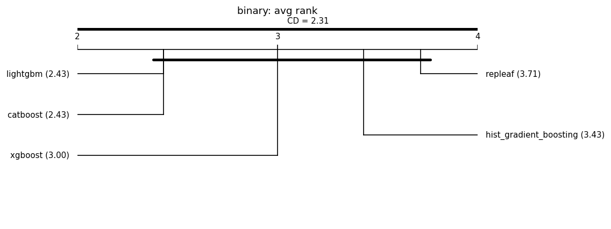

# Fair leaderboard (same-budget HPO)

Auto-generated by `benchmarks/leaderboard.py`. Every model is tuned with an **identical Optuna trial budget** on the same split and seed, then scored once on held-out test data. This replaces the earlier tuned-vs-default comparisons.

**Honest positioning:** under fair tuning RepLeafGBM is expected to be *competitive but not state-of-the-art on average*; its defensible support is in niche regimes (see the robust multi-output and router-extraction studies). No headline is claimed without a significance test, and null/negative results are reported alongside wins. **Model defaults are not changed here** — that requires a `results-analyst` report.

## Reproducibility manifest

- run_id: 20260702T222652Z; git: c7caa46 (dirty=False)
- python: 3.11.1 on macOS-26.5.1-arm64-arm-64bit
- OMP_NUM_THREADS: 1
- packages: numpy=1.26.4, pandas=1.5.2, scipy=1.10.0, scikit-learn=1.9.0, repleafgbm=0.0.1, optuna=4.6.0, lightgbm=4.6.0, xgboost=3.2.0, catboost=1.2.10, matplotlib=3.6.2
- suite: grinsztajn_cat_cls; seeds: [0, 1, 2, 3, 4, 5, 6, 7, 8, 9]; HPO trials/model: 50 (identical budget per model); max_rows: 20000
- split: 70%/15%/15% (Grinsztajn; train capped at 10k, stratified for classification); alpha=0.05; MRD=1% relative
- Equal trial count is the budget; it is **not** equal wall-clock.

## Binary (7 datasets)

### electricity

| model | logloss | auc | fit[s] |
|---|---|---|---|
| hist_gradient_boosting | 0.2716 | 0.9552 | 2.8 |
| lightgbm | 0.2741 | 0.9544 | 16.9 |
| repleaf | 0.2741 | 0.9549 | 6.7 |
| xgboost | 0.2785 | 0.9530 | 1.2 |
| catboost | 0.2846 | 0.9508 | 16.2 |

### eye_movements

| model | logloss | auc | fit[s] |
|---|---|---|---|
| lightgbm | 0.5942 | 0.7412 | 22.3 |
| xgboost | 0.6043 | 0.7322 | 4.1 |
| hist_gradient_boosting | 0.6047 | 0.7289 | 3.8 |
| repleaf | 0.6086 | 0.7244 | 10.5 |
| catboost | 0.6234 | 0.7060 | 16.4 |

### covertype

| model | logloss | auc | fit[s] |
|---|---|---|---|
| catboost | 0.3079 | 0.9423 | 31.9 |
| repleaf | 0.3117 | 0.9414 | 37.8 |
| hist_gradient_boosting | 0.3148 | 0.9401 | 9.6 |
| lightgbm | 0.3163 | 0.9389 | 19.0 |
| xgboost | 0.3218 | 0.9370 | 3.1 |

### albert

| model | logloss | auc | fit[s] |
|---|---|---|---|
| catboost | 0.6223 | 0.7097 | 11.4 |
| xgboost | 0.6226 | 0.7095 | 0.6 |
| lightgbm | 0.6229 | 0.7093 | 3.4 |
| repleaf | 0.6237 | 0.7084 | 13.2 |
| hist_gradient_boosting | 0.6239 | 0.7080 | 1.6 |

### default-of-credit-card-clients

| model | logloss | auc | fit[s] |
|---|---|---|---|
| xgboost | 0.5564 | 0.7845 | 1.0 |
| lightgbm | 0.5565 | 0.7843 | 3.4 |
| catboost | 0.5566 | 0.7840 | 4.4 |
| repleaf | 0.5572 | 0.7829 | 16.7 |
| hist_gradient_boosting | 0.5578 | 0.7822 | 1.6 |

### road-safety

| model | logloss | auc | fit[s] |
|---|---|---|---|
| catboost | 0.4518 | 0.8644 | 13.2 |
| lightgbm | 0.4598 | 0.8602 | 12.0 |
| hist_gradient_boosting | 0.4606 | 0.8598 | 3.4 |
| repleaf | 0.4618 | 0.8585 | 22.3 |
| xgboost | 0.4627 | 0.8583 | 2.3 |

### compas-two-years

| model | logloss | auc | fit[s] |
|---|---|---|---|
| catboost | 0.6041 | 0.7348 | 0.2 |
| xgboost | 0.6065 | 0.7328 | 0.1 |
| lightgbm | 0.6090 | 0.7300 | 0.9 |
| hist_gradient_boosting | 0.6099 | 0.7289 | 0.4 |
| repleaf | 0.6102 | 0.7280 | 0.8 |

### Aggregate — binary

Friedman chi-square = 3.771, p = 0.438 (no detected difference at alpha=0.05).

Critical difference (Nemenyi, CD = 2.305); lower average rank = better.

| place | model | avg rank |
|---|---|---|
| 1 | lightgbm | 2.429 |
| 2 | catboost | 2.429 |
| 3 | xgboost | 3.000 |
| 4 | hist_gradient_boosting | 3.429 |
| 5 | repleaf | 3.714 |

Groups **not** significantly different (avg-rank span <= CD):
- {lightgbm, catboost, xgboost, hist_gradient_boosting, repleaf}

Baseline for pairwise tests: **lightgbm** (best average rank). A model is **bold** when it beats the baseline with Wilcoxon p < 0.05 **and** by more than the MRD (1% relative).

| model | avg rank | Wilcoxon p vs base | median delta | win/tie/loss | verdict |
|---|---|---|---|---|---|
| lightgbm (baseline) | 2.43 | - | - | - | - |
| catboost | 2.43 | 1 | -0.0007 | 2/3/2 | not sig. |
| xgboost | 3.00 | 0.219 | +0.0029 | 0/4/3 | not sig. |
| hist_gradient_boosting | 3.43 | 0.688 | +0.0009 | 0/6/1 | not sig. |
| repleaf | 3.71 | 0.219 | +0.0008 | 1/5/1 | not sig. |

