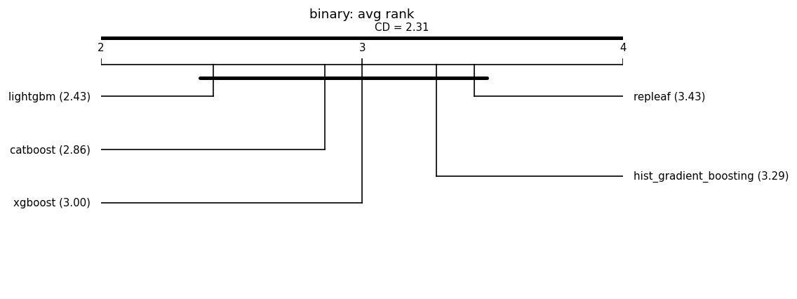

# Fair leaderboard (same-budget HPO)

Auto-generated by `benchmarks/leaderboard.py`. Every model is tuned with an **identical Optuna trial budget** on the same split and seed, then scored once on held-out test data. This replaces the earlier tuned-vs-default comparisons.

**Honest positioning:** under fair tuning RepLeafGBM is expected to be *competitive but not state-of-the-art on average*; its defensible support is in niche regimes (see the robust multi-output and router-extraction studies). No headline is claimed without a significance test, and null/negative results are reported alongside wins. **Model defaults are not changed here** — that requires a `results-analyst` report.

## Reproducibility manifest

- run_id: 20260627T111344Z; git: 607d8d9 (dirty=True)
- python: 3.11.1 on macOS-26.5.1-arm64-arm-64bit
- OMP_NUM_THREADS: 1
- packages: numpy=1.23.5, pandas=1.5.2, scipy=1.10.0, scikit-learn=1.2.0, repleafgbm=0.0.1, optuna=4.6.0, lightgbm=4.6.0, xgboost=3.2.0, catboost=1.2.10, matplotlib=3.6.2
- suite: grinsztajn_cat_cls; seeds: [0, 1, 2, 3, 4]; HPO trials/model: 50 (identical budget per model); max_rows: 20000
- split: 70%/15%/15% (Grinsztajn; train capped at 10k, stratified for classification); alpha=0.05; MRD=1% relative
- Equal trial count is the budget; it is **not** equal wall-clock.

## Binary (7 datasets)

### electricity

| model | logloss | auc | fit[s] |
|---|---|---|---|
| hist_gradient_boosting | 0.2692 | 0.9565 | 1.2 |
| repleaf | 0.2728 | 0.9554 | 2.6 |
| lightgbm | 0.2762 | 0.9537 | 4.0 |
| xgboost | 0.2763 | 0.9539 | 0.5 |
| catboost | 0.2831 | 0.9511 | 4.2 |

### eye_movements

| model | logloss | auc | fit[s] |
|---|---|---|---|
| lightgbm | 0.5889 | 0.7474 | 8.0 |
| xgboost | 0.6012 | 0.7325 | 1.3 |
| hist_gradient_boosting | 0.6060 | 0.7282 | 2.1 |
| repleaf | 0.6062 | 0.7254 | 5.2 |
| catboost | 0.6197 | 0.7123 | 4.2 |

### covertype

| model | logloss | auc | fit[s] |
|---|---|---|---|
| repleaf | 0.3022 | 0.9444 | 13.5 |
| catboost | 0.3022 | 0.9443 | 7.9 |
| hist_gradient_boosting | 0.3087 | 0.9420 | 6.2 |
| lightgbm | 0.3098 | 0.9413 | 9.3 |
| xgboost | 0.3147 | 0.9400 | 1.5 |

### albert

| model | logloss | auc | fit[s] |
|---|---|---|---|
| catboost | 0.6210 | 0.7113 | 1.6 |
| xgboost | 0.6215 | 0.7109 | 0.2 |
| lightgbm | 0.6217 | 0.7109 | 1.2 |
| repleaf | 0.6221 | 0.7106 | 7.1 |
| hist_gradient_boosting | 0.6223 | 0.7101 | 0.6 |

### default-of-credit-card-clients

| model | logloss | auc | fit[s] |
|---|---|---|---|
| lightgbm | 0.5626 | 0.7795 | 1.0 |
| xgboost | 0.5632 | 0.7788 | 0.4 |
| repleaf | 0.5639 | 0.7777 | 3.1 |
| hist_gradient_boosting | 0.5639 | 0.7777 | 0.4 |
| catboost | 0.5640 | 0.7779 | 0.6 |

### road-safety

| model | logloss | auc | fit[s] |
|---|---|---|---|
| catboost | 0.4488 | 0.8665 | 9.1 |
| lightgbm | 0.4573 | 0.8619 | 9.6 |
| hist_gradient_boosting | 0.4590 | 0.8606 | 2.9 |
| xgboost | 0.4596 | 0.8603 | 2.2 |
| repleaf | 0.4601 | 0.8601 | 19.7 |

### compas-two-years

| model | logloss | auc | fit[s] |
|---|---|---|---|
| catboost | 0.6077 | 0.7299 | 0.2 |
| xgboost | 0.6104 | 0.7276 | 0.0 |
| lightgbm | 0.6130 | 0.7236 | 0.7 |
| hist_gradient_boosting | 0.6145 | 0.7223 | 0.3 |
| repleaf | 0.6148 | 0.7217 | 0.4 |

### Aggregate — binary

Friedman chi-square = 1.714, p = 0.788 (no detected difference at alpha=0.05).

Critical difference (Nemenyi, CD = 2.305); lower average rank = better.

| place | model | avg rank |
|---|---|---|
| 1 | lightgbm | 2.429 |
| 2 | catboost | 2.857 |
| 3 | xgboost | 3.000 |
| 4 | hist_gradient_boosting | 3.286 |
| 5 | repleaf | 3.429 |

Groups **not** significantly different (avg-rank span <= CD):
- {lightgbm, catboost, xgboost, hist_gradient_boosting, repleaf}

Baseline for pairwise tests: **lightgbm** (best average rank). A model is **bold** when it beats the baseline with Wilcoxon p < 0.05 **and** by more than the MRD (1% relative).

| model | avg rank | Wilcoxon p vs base | median delta | win/tie/loss | verdict |
|---|---|---|---|---|---|
| lightgbm (baseline) | 2.43 | - | - | - | - |
| catboost | 2.86 | 0.938 | -0.0007 | 2/3/2 | not sig. |
| xgboost | 3.00 | 0.219 | +0.0007 | 0/5/2 | not sig. |
| hist_gradient_boosting | 3.29 | 0.375 | +0.0013 | 1/5/1 | not sig. |
| repleaf | 3.43 | 0.688 | +0.0013 | 2/4/1 | not sig. |

