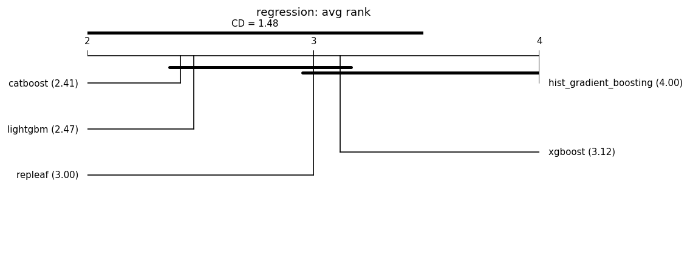

# Fair leaderboard (same-budget HPO)

Auto-generated by `benchmarks/leaderboard.py`. Every model is tuned with an **identical Optuna trial budget** on the same split and seed, then scored once on held-out test data. This replaces the earlier tuned-vs-default comparisons.

**Honest positioning:** under fair tuning RepLeafGBM is expected to be *competitive but not state-of-the-art on average*; its defensible support is in niche regimes (see the robust multi-output and router-extraction studies). No headline is claimed without a significance test, and null/negative results are reported alongside wins. **Model defaults are not changed here** — that requires a `results-analyst` report.

## Reproducibility manifest

- run_id: 20260702T222652Z; git: c7caa46 (dirty=False)
- python: 3.11.1 on macOS-26.5.1-arm64-arm-64bit
- OMP_NUM_THREADS: 1
- packages: numpy=1.26.4, pandas=1.5.2, scipy=1.10.0, scikit-learn=1.9.0, repleafgbm=0.0.1, optuna=4.6.0, lightgbm=4.6.0, xgboost=3.2.0, catboost=1.2.10, matplotlib=3.6.2
- suite: grinsztajn_cat_reg; seeds: [0, 1, 2, 3, 4, 5, 6, 7, 8, 9]; HPO trials/model: 50 (identical budget per model); max_rows: 20000
- split: 70%/15%/15% (Grinsztajn; train capped at 10k, stratified for classification); alpha=0.05; MRD=1% relative
- Equal trial count is the budget; it is **not** equal wall-clock.

## Regression (17 datasets)

### analcatdata_supreme

| model | rmse | r2 | fit[s] |
|---|---|---|---|
| catboost | 0.0685 | 0.9825 | 0.6 |
| xgboost | 0.0692 | 0.9823 | 0.2 |
| repleaf | 0.0710 | 0.9815 | 1.4 |
| hist_gradient_boosting | 0.0713 | 0.9814 | 0.6 |
| lightgbm | 0.0713 | 0.9811 | 10.9 |

### visualizing_soil

| model | rmse | r2 | fit[s] |
|---|---|---|---|
| repleaf | 0.0477 | 1.0000 | 4.5 |
| lightgbm | 0.0545 | 1.0000 | 20.0 |
| hist_gradient_boosting | 0.0555 | 1.0000 | 2.1 |
| catboost | 0.0652 | 1.0000 | 6.2 |
| xgboost | 0.1968 | 0.9997 | 0.3 |

### diamonds

| model | rmse | r2 | fit[s] |
|---|---|---|---|
| repleaf | 0.0904 | 0.9921 | 8.0 |
| lightgbm | 0.0909 | 0.9920 | 11.8 |
| catboost | 0.0909 | 0.9920 | 4.8 |
| hist_gradient_boosting | 0.0916 | 0.9919 | 1.7 |
| xgboost | 0.0917 | 0.9918 | 0.8 |

### Mercedes_Benz_Greener_Manufacturing

| model | rmse | r2 | fit[s] |
|---|---|---|---|
| catboost | 7.9352 | 0.5961 | 3.0 |
| xgboost | 7.9514 | 0.5945 | 0.6 |
| lightgbm | 8.0081 | 0.5887 | 1.9 |
| repleaf | 8.0233 | 0.5869 | 9.0 |
| hist_gradient_boosting | 8.0394 | 0.5855 | 8.4 |

### Brazilian_houses

| model | rmse | r2 | fit[s] |
|---|---|---|---|
| catboost | 0.0556 | 0.9942 | 3.3 |
| repleaf | 0.0609 | 0.9933 | 7.7 |
| xgboost | 0.0650 | 0.9920 | 0.9 |
| lightgbm | 0.0656 | 0.9921 | 13.1 |
| hist_gradient_boosting | 0.0777 | 0.9894 | 2.2 |

### Bike_Sharing_Demand

| model | rmse | r2 | fit[s] |
|---|---|---|---|
| catboost | 41.3076 | 0.9484 | 9.5 |
| hist_gradient_boosting | 42.3813 | 0.9457 | 3.6 |
| lightgbm | 42.4626 | 0.9455 | 15.6 |
| xgboost | 42.4866 | 0.9455 | 1.9 |
| repleaf | 42.6513 | 0.9450 | 5.8 |

### nyc-taxi-green-dec-2016

| model | rmse | r2 | fit[s] |
|---|---|---|---|
| lightgbm | 0.3959 | 0.5616 | 21.2 |
| catboost | 0.3986 | 0.5556 | 3.4 |
| repleaf | 0.3992 | 0.5544 | 16.7 |
| hist_gradient_boosting | 0.4021 | 0.5480 | 3.2 |
| xgboost | 0.4098 | 0.5303 | 0.7 |

### house_sales

| model | rmse | r2 | fit[s] |
|---|---|---|---|
| catboost | 0.1687 | 0.8987 | 9.3 |
| lightgbm | 0.1697 | 0.8975 | 15.1 |
| xgboost | 0.1708 | 0.8963 | 1.5 |
| repleaf | 0.1709 | 0.8961 | 11.1 |
| hist_gradient_boosting | 0.1716 | 0.8953 | 2.7 |

### particulate-matter-ukair-2017

| model | rmse | r2 | fit[s] |
|---|---|---|---|
| xgboost | 0.3820 | 0.6846 | 0.4 |
| repleaf | 0.3827 | 0.6835 | 5.1 |
| lightgbm | 0.3827 | 0.6834 | 7.8 |
| catboost | 0.3831 | 0.6828 | 2.8 |
| hist_gradient_boosting | 0.3831 | 0.6828 | 0.8 |

### SGEMM_GPU_kernel_performance

| model | rmse | r2 | fit[s] |
|---|---|---|---|
| repleaf | 0.0149 | 0.9998 | 9.1 |
| xgboost | 0.0173 | 0.9998 | 0.7 |
| lightgbm | 0.0173 | 0.9998 | 6.3 |
| hist_gradient_boosting | 0.0176 | 0.9998 | 1.6 |
| catboost | 0.0178 | 0.9997 | 5.0 |

### topo_2_1

| model | rmse | r2 | fit[s] |
|---|---|---|---|
| lightgbm | 0.0282 | 0.0753 | 11.6 |
| xgboost | 0.0283 | 0.0717 | 24.4 |
| catboost | 0.0283 | 0.0687 | 113.5 |
| repleaf | 0.0284 | 0.0643 | 23.7 |
| hist_gradient_boosting | 0.0284 | 0.0642 | 13.8 |

### abalone

| model | rmse | r2 | fit[s] |
|---|---|---|---|
| repleaf | 2.0858 | 0.5638 | 0.9 |
| lightgbm | 2.0870 | 0.5636 | 1.8 |
| hist_gradient_boosting | 2.0952 | 0.5600 | 0.5 |
| xgboost | 2.1150 | 0.5516 | 0.2 |
| catboost | 2.1222 | 0.5484 | 1.6 |

### seattlecrime6

| model | rmse | r2 | fit[s] |
|---|---|---|---|
| catboost | 380.3463 | 0.1851 | 0.6 |
| lightgbm | 380.3639 | 0.1850 | 1.3 |
| hist_gradient_boosting | 380.4235 | 0.1848 | 0.4 |
| xgboost | 380.5514 | 0.1842 | 0.1 |
| repleaf | 380.5850 | 0.1841 | 1.3 |

### delays_zurich_transport

| model | rmse | r2 | fit[s] |
|---|---|---|---|
| lightgbm | 3.0100 | 0.0740 | 1.9 |
| xgboost | 3.0137 | 0.0718 | 0.2 |
| catboost | 3.0144 | 0.0713 | 1.4 |
| hist_gradient_boosting | 3.0157 | 0.0705 | 0.7 |
| repleaf | 3.0159 | 0.0704 | 4.9 |

### Allstate_Claims_Severity

| model | rmse | r2 | fit[s] |
|---|---|---|---|
| lightgbm | 0.5594 | 0.5235 | 7.6 |
| catboost | 0.5604 | 0.5219 | 10.4 |
| xgboost | 0.5612 | 0.5205 | 2.1 |
| hist_gradient_boosting | 0.5624 | 0.5184 | 9.2 |
| repleaf | 0.5626 | 0.5180 | 54.6 |

### Airlines_DepDelay_1M

| model | rmse | r2 | fit[s] |
|---|---|---|---|
| xgboost | 1.9235 | 0.0476 | 0.2 |
| catboost | 1.9247 | 0.0463 | 0.8 |
| lightgbm | 1.9256 | 0.0455 | 1.2 |
| repleaf | 1.9258 | 0.0453 | 0.8 |
| hist_gradient_boosting | 1.9259 | 0.0452 | 0.3 |

### medical_charges

| model | rmse | r2 | fit[s] |
|---|---|---|---|
| repleaf | 0.0798 | 0.9801 | 1.0 |
| catboost | 0.0805 | 0.9797 | 1.2 |
| hist_gradient_boosting | 0.0807 | 0.9796 | 0.4 |
| lightgbm | 0.0809 | 0.9795 | 2.1 |
| xgboost | 0.0812 | 0.9794 | 0.2 |

### Aggregate — regression

Friedman chi-square = 11.153, p = 0.0249 (models differ at alpha=0.05).

Critical difference (Nemenyi, CD = 1.479); lower average rank = better.

| place | model | avg rank |
|---|---|---|
| 1 | catboost | 2.412 |
| 2 | lightgbm | 2.471 |
| 3 | repleaf | 3.000 |
| 4 | xgboost | 3.118 |
| 5 | hist_gradient_boosting | 4.000 |

Groups **not** significantly different (avg-rank span <= CD):
- {catboost, lightgbm, repleaf, xgboost}
- {repleaf, xgboost, hist_gradient_boosting}

Baseline for pairwise tests: **catboost** (best average rank). A model is **bold** when it beats the baseline with Wilcoxon p < 0.05 **and** by more than the MRD (1% relative).

| model | avg rank | Wilcoxon p vs base | median delta | win/tie/loss | verdict |
|---|---|---|---|---|---|
| catboost (baseline) | 2.41 | - | - | - | - |
| lightgbm | 2.47 | 0.678 | -0.0000 | 3/11/3 | not sig. |
| repleaf | 3.00 | 0.207 | +0.0011 | 3/9/5 | not sig. |
| xgboost | 3.12 | 0.0505 | +0.0008 | 1/11/5 | not sig. |
| hist_gradient_boosting | 4.00 | 0.0232 | +0.0012 | 2/10/5 | not sig. |

