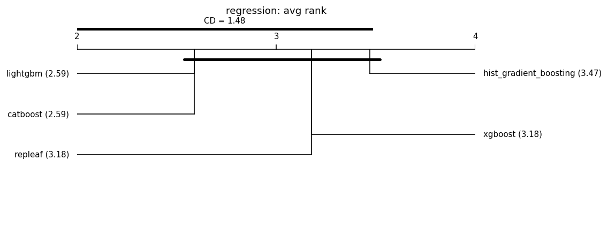

# Fair leaderboard (same-budget HPO)

Auto-generated by `benchmarks/leaderboard.py`. Every model is tuned with an **identical Optuna trial budget** on the same split and seed, then scored once on held-out test data. This replaces the earlier tuned-vs-default comparisons.

**Honest positioning:** under fair tuning RepLeafGBM is expected to be *competitive but not state-of-the-art on average*; its defensible support is in niche regimes (see the robust multi-output and router-extraction studies). No headline is claimed without a significance test, and null/negative results are reported alongside wins. **Model defaults are not changed here** — that requires a `results-analyst` report.

## Reproducibility manifest

- run_id: 20260627T111344Z; git: 607d8d9 (dirty=True)
- python: 3.11.1 on macOS-26.5.1-arm64-arm-64bit
- OMP_NUM_THREADS: 1
- packages: numpy=1.23.5, pandas=1.5.2, scipy=1.10.0, scikit-learn=1.2.0, repleafgbm=0.0.1, optuna=4.6.0, lightgbm=4.6.0, xgboost=3.2.0, catboost=1.2.10, matplotlib=3.6.2
- suite: grinsztajn_cat_reg; seeds: [0, 1, 2, 3, 4]; HPO trials/model: 50 (identical budget per model); max_rows: 20000
- split: 70%/15%/15% (Grinsztajn; train capped at 10k, stratified for classification); alpha=0.05; MRD=1% relative
- Equal trial count is the budget; it is **not** equal wall-clock.

## Regression (17 datasets)

### analcatdata_supreme

| model | rmse | r2 | fit[s] |
|---|---|---|---|
| xgboost | 0.0720 | 0.9826 | 0.0 |
| catboost | 0.0723 | 0.9824 | 0.2 |
| lightgbm | 0.0736 | 0.9817 | 2.7 |
| repleaf | 0.0741 | 0.9815 | 0.6 |
| hist_gradient_boosting | 0.0748 | 0.9811 | 0.2 |

### visualizing_soil

| model | rmse | r2 | fit[s] |
|---|---|---|---|
| repleaf | 0.0527 | 1.0000 | 1.3 |
| lightgbm | 0.0575 | 1.0000 | 7.4 |
| hist_gradient_boosting | 0.0597 | 1.0000 | 0.8 |
| catboost | 0.0666 | 1.0000 | 1.7 |
| xgboost | 0.2081 | 0.9997 | 0.1 |

### diamonds

| model | rmse | r2 | fit[s] |
|---|---|---|---|
| repleaf | 0.0906 | 0.9919 | 1.4 |
| lightgbm | 0.0909 | 0.9919 | 4.7 |
| catboost | 0.0910 | 0.9919 | 0.9 |
| hist_gradient_boosting | 0.0916 | 0.9918 | 0.8 |
| xgboost | 0.0917 | 0.9918 | 0.4 |

### Mercedes_Benz_Greener_Manufacturing

| model | rmse | r2 | fit[s] |
|---|---|---|---|
| catboost | 7.7428 | 0.6146 | 0.6 |
| xgboost | 7.7588 | 0.6130 | 0.4 |
| repleaf | 7.8075 | 0.6081 | 2.6 |
| lightgbm | 7.8180 | 0.6071 | 0.5 |
| hist_gradient_boosting | 7.8364 | 0.6053 | 4.8 |

### Brazilian_houses

| model | rmse | r2 | fit[s] |
|---|---|---|---|
| catboost | 0.0463 | 0.9959 | 0.8 |
| repleaf | 0.0572 | 0.9943 | 2.3 |
| xgboost | 0.0590 | 0.9941 | 0.4 |
| lightgbm | 0.0612 | 0.9939 | 4.0 |
| hist_gradient_boosting | 0.0672 | 0.9927 | 1.7 |

### Bike_Sharing_Demand

| model | rmse | r2 | fit[s] |
|---|---|---|---|
| catboost | 41.6743 | 0.9474 | 1.9 |
| lightgbm | 42.6339 | 0.9450 | 5.4 |
| hist_gradient_boosting | 42.7116 | 0.9448 | 1.2 |
| xgboost | 42.8512 | 0.9444 | 0.5 |
| repleaf | 43.0619 | 0.9439 | 1.6 |

### nyc-taxi-green-dec-2016

| model | rmse | r2 | fit[s] |
|---|---|---|---|
| lightgbm | 0.3933 | 0.5642 | 10.1 |
| catboost | 0.3958 | 0.5587 | 1.0 |
| hist_gradient_boosting | 0.3981 | 0.5537 | 2.6 |
| repleaf | 0.3987 | 0.5522 | 9.2 |
| xgboost | 0.4078 | 0.5316 | 0.5 |

### particulate-matter-ukair-2017

| model | rmse | r2 | fit[s] |
|---|---|---|---|
| hist_gradient_boosting | 0.3784 | 0.6863 | 0.4 |
| xgboost | 0.3786 | 0.6860 | 0.2 |
| catboost | 0.3791 | 0.6852 | 0.7 |
| repleaf | 0.3793 | 0.6847 | 1.0 |
| lightgbm | 0.3797 | 0.6841 | 2.8 |

### SGEMM_GPU_kernel_performance

| model | rmse | r2 | fit[s] |
|---|---|---|---|
| repleaf | 0.0145 | 0.9998 | 1.2 |
| xgboost | 0.0169 | 0.9998 | 0.3 |
| lightgbm | 0.0171 | 0.9998 | 2.7 |
| hist_gradient_boosting | 0.0172 | 0.9998 | 0.5 |
| catboost | 0.0175 | 0.9998 | 1.1 |

### topo_2_1

| model | rmse | r2 | fit[s] |
|---|---|---|---|
| lightgbm | 0.0294 | 0.0729 | 3.4 |
| xgboost | 0.0294 | 0.0697 | 7.4 |
| hist_gradient_boosting | 0.0295 | 0.0670 | 6.8 |
| catboost | 0.0295 | 0.0661 | 39.1 |
| repleaf | 0.0296 | 0.0594 | 5.1 |

### abalone

| model | rmse | r2 | fit[s] |
|---|---|---|---|
| hist_gradient_boosting | 2.1002 | 0.5522 | 0.3 |
| lightgbm | 2.1017 | 0.5515 | 0.7 |
| repleaf | 2.1088 | 0.5482 | 0.2 |
| xgboost | 2.1394 | 0.5352 | 0.1 |
| catboost | 2.1441 | 0.5329 | 0.3 |

### seattlecrime6

| model | rmse | r2 | fit[s] |
|---|---|---|---|
| hist_gradient_boosting | 378.6608 | 0.1927 | 0.2 |
| catboost | 378.8430 | 0.1920 | 0.2 |
| xgboost | 378.9584 | 0.1915 | 0.1 |
| lightgbm | 378.9596 | 0.1915 | 0.5 |
| repleaf | 378.9604 | 0.1915 | 0.3 |

### delays_zurich_transport

| model | rmse | r2 | fit[s] |
|---|---|---|---|
| lightgbm | 2.9951 | 0.0778 | 0.6 |
| repleaf | 2.9967 | 0.0768 | 2.5 |
| catboost | 2.9973 | 0.0764 | 0.3 |
| xgboost | 2.9983 | 0.0758 | 0.1 |
| hist_gradient_boosting | 3.0001 | 0.0747 | 0.3 |

### Allstate_Claims_Severity

| model | rmse | r2 | fit[s] |
|---|---|---|---|
| lightgbm | 0.5612 | 0.5211 | 3.8 |
| catboost | 0.5627 | 0.5183 | 3.4 |
| xgboost | 0.5641 | 0.5160 | 0.9 |
| repleaf | 0.5642 | 0.5158 | 16.4 |
| hist_gradient_boosting | 0.5646 | 0.5153 | 4.7 |

### Airlines_DepDelay_1M

| model | rmse | r2 | fit[s] |
|---|---|---|---|
| xgboost | 1.9223 | 0.0475 | 0.1 |
| catboost | 1.9236 | 0.0462 | 0.4 |
| lightgbm | 1.9241 | 0.0458 | 0.5 |
| hist_gradient_boosting | 1.9258 | 0.0440 | 0.1 |
| repleaf | 1.9259 | 0.0440 | 0.3 |

### medical_charges

| model | rmse | r2 | fit[s] |
|---|---|---|---|
| repleaf | 0.0783 | 0.9810 | 0.5 |
| hist_gradient_boosting | 0.0793 | 0.9805 | 0.2 |
| catboost | 0.0793 | 0.9805 | 0.6 |
| lightgbm | 0.0797 | 0.9803 | 1.0 |
| xgboost | 0.0799 | 0.9802 | 0.1 |

### house_sales

| model | rmse | r2 | fit[s] |
|---|---|---|---|
| catboost | 0.1702 | 0.8985 | 1.7 |
| lightgbm | 0.1707 | 0.8979 | 4.7 |
| xgboost | 0.1722 | 0.8962 | 0.7 |
| repleaf | 0.1726 | 0.8956 | 1.6 |
| hist_gradient_boosting | 0.1733 | 0.8948 | 1.0 |

### Aggregate — regression

Friedman chi-square = 4.235, p = 0.375 (no detected difference at alpha=0.05).

Critical difference (Nemenyi, CD = 1.479); lower average rank = better.

| place | model | avg rank |
|---|---|---|
| 1 | lightgbm | 2.588 |
| 2 | catboost | 2.588 |
| 3 | repleaf | 3.176 |
| 4 | xgboost | 3.176 |
| 5 | hist_gradient_boosting | 3.471 |

Groups **not** significantly different (avg-rank span <= CD):
- {lightgbm, catboost, repleaf, xgboost, hist_gradient_boosting}

Baseline for pairwise tests: **lightgbm** (best average rank). A model is **bold** when it beats the baseline with Wilcoxon p < 0.05 **and** by more than the MRD (1% relative).

| model | avg rank | Wilcoxon p vs base | median delta | win/tie/loss | verdict |
|---|---|---|---|---|---|
| lightgbm (baseline) | 2.59 | - | - | - | - |
| catboost | 2.59 | 0.548 | -0.0004 | 3/11/3 | not sig. |
| repleaf | 3.18 | 0.517 | +0.0005 | 4/10/3 | not sig. |
| xgboost | 3.18 | 0.329 | +0.0002 | 2/12/3 | not sig. |
| hist_gradient_boosting | 3.47 | 0.0395 | +0.0018 | 0/12/5 | not sig. |

