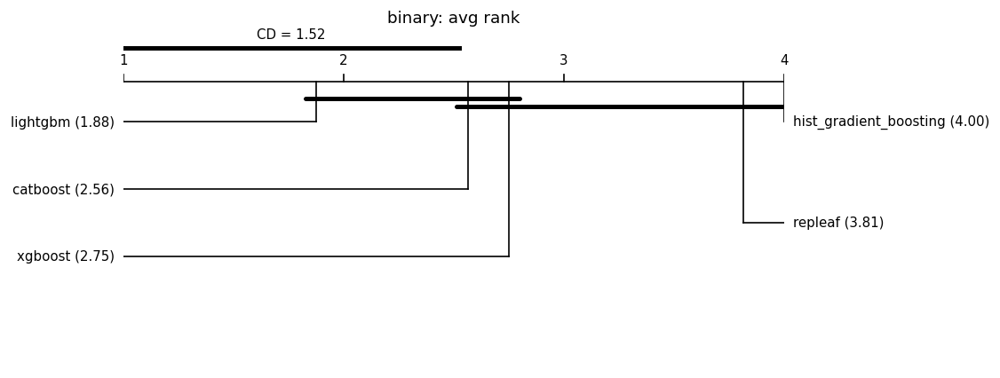

# Fair leaderboard (same-budget HPO)

Auto-generated by `benchmarks/leaderboard.py`. Every model is tuned with an **identical Optuna trial budget** on the same split and seed, then scored once on held-out test data. This replaces the earlier tuned-vs-default comparisons.

**Honest positioning:** under fair tuning RepLeafGBM is expected to be *competitive but not state-of-the-art on average*; its defensible support is in niche regimes (see the robust multi-output and router-extraction studies). No headline is claimed without a significance test, and null/negative results are reported alongside wins. **Model defaults are not changed here** — that requires a `results-analyst` report.

## Reproducibility manifest

- run_id: 20260702T222652Z; git: c7caa46 (dirty=False)
- python: 3.11.1 on macOS-26.5.1-arm64-arm-64bit
- OMP_NUM_THREADS: 1
- packages: numpy=1.26.4, pandas=1.5.2, scipy=1.10.0, scikit-learn=1.9.0, repleafgbm=0.0.1, optuna=4.6.0, lightgbm=4.6.0, xgboost=3.2.0, catboost=1.2.10, matplotlib=3.6.2
- suite: grinsztajn_num_cls; seeds: [0, 1, 2, 3, 4, 5, 6, 7, 8, 9]; HPO trials/model: 50 (identical budget per model); max_rows: 20000
- split: 70%/15%/15% (Grinsztajn; train capped at 10k, stratified for classification); alpha=0.05; MRD=1% relative
- Equal trial count is the budget; it is **not** equal wall-clock.

## Binary (16 datasets)

### credit

| model | logloss | auc | fit[s] |
|---|---|---|---|
| lightgbm | 0.4734 | 0.8558 | 4.0 |
| xgboost | 0.4736 | 0.8554 | 0.3 |
| catboost | 0.4738 | 0.8555 | 3.8 |
| hist_gradient_boosting | 0.4746 | 0.8550 | 1.2 |
| repleaf | 0.4752 | 0.8545 | 4.9 |

### electricity

| model | logloss | auc | fit[s] |
|---|---|---|---|
| hist_gradient_boosting | 0.3134 | 0.9404 | 2.4 |
| lightgbm | 0.3137 | 0.9401 | 16.8 |
| repleaf | 0.3154 | 0.9392 | 4.6 |
| xgboost | 0.3176 | 0.9380 | 1.0 |
| catboost | 0.3254 | 0.9354 | 14.5 |

### covertype

| model | logloss | auc | fit[s] |
|---|---|---|---|
| repleaf | 0.3873 | 0.9070 | 13.3 |
| catboost | 0.3880 | 0.9056 | 31.4 |
| lightgbm | 0.3906 | 0.9044 | 23.1 |
| hist_gradient_boosting | 0.3909 | 0.9041 | 2.7 |
| xgboost | 0.3953 | 0.9014 | 1.8 |

### pol

| model | logloss | auc | fit[s] |
|---|---|---|---|
| catboost | 0.0356 | 0.9992 | 18.1 |
| hist_gradient_boosting | 0.0396 | 0.9991 | 3.7 |
| repleaf | 0.0397 | 0.9991 | 23.0 |
| lightgbm | 0.0404 | 0.9990 | 7.3 |
| xgboost | 0.0410 | 0.9990 | 0.9 |

### house_16H

| model | logloss | auc | fit[s] |
|---|---|---|---|
| catboost | 0.2729 | 0.9547 | 17.6 |
| xgboost | 0.2737 | 0.9548 | 2.6 |
| lightgbm | 0.2737 | 0.9549 | 7.0 |
| repleaf | 0.2745 | 0.9547 | 16.4 |
| hist_gradient_boosting | 0.2767 | 0.9542 | 3.1 |

### MagicTelescope

| model | logloss | auc | fit[s] |
|---|---|---|---|
| catboost | 0.3159 | 0.9359 | 4.9 |
| xgboost | 0.3191 | 0.9347 | 1.3 |
| lightgbm | 0.3200 | 0.9348 | 11.0 |
| repleaf | 0.3226 | 0.9332 | 6.9 |
| hist_gradient_boosting | 0.3231 | 0.9332 | 2.6 |

### bank-marketing

| model | logloss | auc | fit[s] |
|---|---|---|---|
| lightgbm | 0.4296 | 0.8828 | 4.5 |
| xgboost | 0.4302 | 0.8824 | 0.3 |
| catboost | 0.4306 | 0.8823 | 2.9 |
| hist_gradient_boosting | 0.4308 | 0.8824 | 0.7 |
| repleaf | 0.4311 | 0.8823 | 2.4 |

### MiniBooNE

| model | logloss | auc | fit[s] |
|---|---|---|---|
| catboost | 0.1657 | 0.9822 | 26.8 |
| lightgbm | 0.1664 | 0.9822 | 11.5 |
| xgboost | 0.1668 | 0.9819 | 5.0 |
| repleaf | 0.1688 | 0.9816 | 54.6 |
| hist_gradient_boosting | 0.1699 | 0.9814 | 4.6 |

### Higgs

| model | logloss | auc | fit[s] |
|---|---|---|---|
| lightgbm | 0.5476 | 0.7945 | 11.9 |
| repleaf | 0.5484 | 0.7935 | 25.4 |
| hist_gradient_boosting | 0.5493 | 0.7931 | 3.7 |
| xgboost | 0.5494 | 0.7929 | 5.3 |
| catboost | 0.5509 | 0.7913 | 17.7 |

### eye_movements

| model | logloss | auc | fit[s] |
|---|---|---|---|
| lightgbm | 0.6037 | 0.7308 | 14.9 |
| xgboost | 0.6044 | 0.7295 | 4.3 |
| repleaf | 0.6066 | 0.7314 | 15.4 |
| hist_gradient_boosting | 0.6109 | 0.7217 | 4.5 |
| catboost | 0.6258 | 0.7000 | 7.3 |

### Bioresponse

| model | logloss | auc | fit[s] |
|---|---|---|---|
| lightgbm | 0.4764 | 0.8575 | 10.5 |
| xgboost | 0.4767 | 0.8555 | 4.0 |
| catboost | 0.4778 | 0.8552 | 44.6 |
| repleaf | 0.4801 | 0.8540 | 21.7 |
| hist_gradient_boosting | 0.4820 | 0.8537 | 17.2 |

### default-of-credit-card-clients

| model | logloss | auc | fit[s] |
|---|---|---|---|
| lightgbm | 0.5553 | 0.7851 | 2.6 |
| xgboost | 0.5569 | 0.7837 | 0.7 |
| catboost | 0.5572 | 0.7832 | 2.8 |
| repleaf | 0.5576 | 0.7824 | 1.7 |
| hist_gradient_boosting | 0.5578 | 0.7821 | 0.7 |

### jannis

| model | logloss | auc | fit[s] |
|---|---|---|---|
| lightgbm | 0.4621 | 0.8605 | 11.8 |
| xgboost | 0.4625 | 0.8603 | 7.8 |
| catboost | 0.4636 | 0.8597 | 10.5 |
| hist_gradient_boosting | 0.4654 | 0.8585 | 5.9 |
| repleaf | 0.4660 | 0.8577 | 17.6 |

### Diabetes130US

| model | logloss | auc | fit[s] |
|---|---|---|---|
| catboost | 0.6613 | 0.6404 | 0.4 |
| xgboost | 0.6619 | 0.6394 | 0.1 |
| lightgbm | 0.6625 | 0.6382 | 0.6 |
| hist_gradient_boosting | 0.6635 | 0.6366 | 0.2 |
| repleaf | 0.6643 | 0.6350 | 0.7 |

### heloc

| model | logloss | auc | fit[s] |
|---|---|---|---|
| catboost | 0.5505 | 0.7936 | 1.0 |
| lightgbm | 0.5517 | 0.7923 | 2.3 |
| xgboost | 0.5519 | 0.7921 | 0.2 |
| hist_gradient_boosting | 0.5539 | 0.7903 | 0.6 |
| repleaf | 0.5541 | 0.7903 | 2.1 |

### california

| model | logloss | auc | fit[s] |
|---|---|---|---|
| lightgbm | 0.2301 | 0.9678 | 3.5 |
| xgboost | 0.2320 | 0.9672 | 0.6 |
| catboost | 0.2321 | 0.9675 | 2.4 |
| repleaf | 0.2339 | 0.9668 | 2.1 |
| hist_gradient_boosting | 0.2341 | 0.9668 | 0.7 |

### Aggregate — binary

Friedman chi-square = 20.350, p = 0.000426 (models differ at alpha=0.05).

Critical difference (Nemenyi, CD = 1.525); lower average rank = better.

| place | model | avg rank |
|---|---|---|
| 1 | lightgbm | 1.875 |
| 2 | catboost | 2.562 |
| 3 | xgboost | 2.750 |
| 4 | repleaf | 3.812 |
| 5 | hist_gradient_boosting | 4.000 |

Groups **not** significantly different (avg-rank span <= CD):
- {lightgbm, catboost, xgboost}
- {catboost, xgboost, repleaf, hist_gradient_boosting}

Baseline for pairwise tests: **lightgbm** (best average rank). A model is **bold** when it beats the baseline with Wilcoxon p < 0.05 **and** by more than the MRD (1% relative).

| model | avg rank | Wilcoxon p vs base | median delta | win/tie/loss | verdict |
|---|---|---|---|---|---|
| lightgbm (baseline) | 1.88 | - | - | - | - |
| catboost | 2.56 | 0.495 | +0.0007 | 2/12/2 | not sig. |
| xgboost | 2.75 | 0.011 | +0.0005 | 0/13/3 | not sig. |
| repleaf | 3.81 | 0.00336 | +0.0020 | 1/13/2 | not sig. |
| hist_gradient_boosting | 4.00 | 0.000214 | +0.0023 | 1/10/5 | not sig. |

