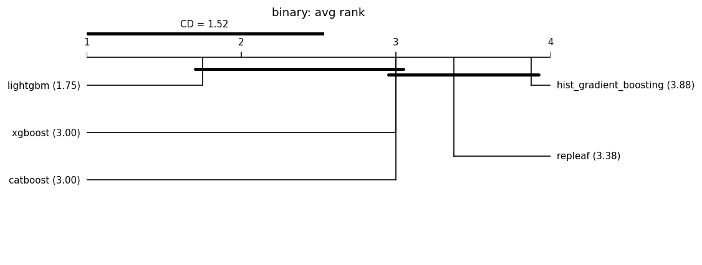

# Fair leaderboard (same-budget HPO)

Auto-generated by `benchmarks/leaderboard.py`. Every model is tuned with an **identical Optuna trial budget** on the same split and seed, then scored once on held-out test data. This replaces the earlier tuned-vs-default comparisons.

**Honest positioning:** under fair tuning RepLeafGBM is expected to be *competitive but not state-of-the-art on average*; its defensible support is in niche regimes (see the robust multi-output and router-extraction studies). No headline is claimed without a significance test, and null/negative results are reported alongside wins. **Model defaults are not changed here** — that requires a `results-analyst` report.

## Reproducibility manifest

- run_id: 20260626T160115Z; git: 5514a3a (dirty=True)
- python: 3.11.1 on macOS-26.5.1-arm64-arm-64bit
- OMP_NUM_THREADS: 1
- packages: numpy=1.23.5, pandas=1.5.2, scipy=1.10.0, scikit-learn=1.2.0, repleafgbm=0.0.1, optuna=4.6.0, lightgbm=4.6.0, xgboost=3.2.0, catboost=1.2.10, matplotlib=3.6.2
- suite: grinsztajn_num_cls; seeds: [0, 1, 2, 3, 4]; HPO trials/model: 50 (identical budget per model); max_rows: 20000
- split: 70%/15%/15% (Grinsztajn; train capped at 10k, stratified for classification); alpha=0.05; MRD=1% relative
- Equal trial count is the budget; it is **not** equal wall-clock.

## Binary (16 datasets)

### credit

| model | logloss | auc | fit[s] |
|---|---|---|---|
| lightgbm | 0.4742 | 0.8553 | 1.1 |
| xgboost | 0.4745 | 0.8549 | 0.1 |
| hist_gradient_boosting | 0.4748 | 0.8548 | 0.4 |
| catboost | 0.4753 | 0.8550 | 0.7 |
| repleaf | 0.4757 | 0.8545 | 0.9 |

### electricity

| model | logloss | auc | fit[s] |
|---|---|---|---|
| lightgbm | 0.3107 | 0.9412 | 6.5 |
| repleaf | 0.3117 | 0.9403 | 2.0 |
| hist_gradient_boosting | 0.3118 | 0.9405 | 1.2 |
| xgboost | 0.3147 | 0.9391 | 0.5 |
| catboost | 0.3234 | 0.9363 | 3.6 |

### covertype

| model | logloss | auc | fit[s] |
|---|---|---|---|
| catboost | 0.3866 | 0.9064 | 6.5 |
| repleaf | 0.3897 | 0.9052 | 5.7 |
| lightgbm | 0.3909 | 0.9034 | 7.7 |
| hist_gradient_boosting | 0.3925 | 0.9029 | 1.5 |
| xgboost | 0.3983 | 0.8997 | 0.7 |

### pol

| model | logloss | auc | fit[s] |
|---|---|---|---|
| catboost | 0.0349 | 0.9992 | 1.9 |
| hist_gradient_boosting | 0.0375 | 0.9991 | 1.0 |
| lightgbm | 0.0381 | 0.9991 | 3.7 |
| xgboost | 0.0387 | 0.9990 | 0.3 |
| repleaf | 0.0390 | 0.9991 | 3.7 |

### house_16H

| model | logloss | auc | fit[s] |
|---|---|---|---|
| lightgbm | 0.2772 | 0.9539 | 2.4 |
| xgboost | 0.2774 | 0.9536 | 0.7 |
| repleaf | 0.2779 | 0.9535 | 3.5 |
| hist_gradient_boosting | 0.2784 | 0.9534 | 1.2 |
| catboost | 0.2790 | 0.9529 | 2.4 |

### MagicTelescope

| model | logloss | auc | fit[s] |
|---|---|---|---|
| catboost | 0.3222 | 0.9329 | 1.1 |
| xgboost | 0.3226 | 0.9328 | 0.6 |
| lightgbm | 0.3260 | 0.9324 | 2.5 |
| repleaf | 0.3269 | 0.9313 | 2.5 |
| hist_gradient_boosting | 0.3294 | 0.9304 | 0.7 |

### bank-marketing

| model | logloss | auc | fit[s] |
|---|---|---|---|
| repleaf | 0.4207 | 0.8877 | 0.9 |
| lightgbm | 0.4211 | 0.8877 | 1.7 |
| catboost | 0.4219 | 0.8873 | 0.9 |
| xgboost | 0.4220 | 0.8872 | 0.2 |
| hist_gradient_boosting | 0.4221 | 0.8873 | 0.5 |

### MiniBooNE

| model | logloss | auc | fit[s] |
|---|---|---|---|
| lightgbm | 0.1599 | 0.9833 | 4.3 |
| catboost | 0.1607 | 0.9830 | 4.1 |
| xgboost | 0.1609 | 0.9831 | 1.2 |
| hist_gradient_boosting | 0.1637 | 0.9825 | 2.3 |
| repleaf | 0.1647 | 0.9825 | 15.5 |

### Higgs

| model | logloss | auc | fit[s] |
|---|---|---|---|
| lightgbm | 0.5449 | 0.7969 | 4.0 |
| repleaf | 0.5465 | 0.7952 | 6.0 |
| hist_gradient_boosting | 0.5476 | 0.7941 | 1.2 |
| catboost | 0.5482 | 0.7940 | 2.1 |
| xgboost | 0.5492 | 0.7937 | 1.7 |

### eye_movements

| model | logloss | auc | fit[s] |
|---|---|---|---|
| xgboost | 0.5994 | 0.7357 | 1.7 |
| lightgbm | 0.5996 | 0.7373 | 7.8 |
| repleaf | 0.6038 | 0.7348 | 6.3 |
| hist_gradient_boosting | 0.6126 | 0.7249 | 2.5 |
| catboost | 0.6248 | 0.7019 | 1.7 |

### Bioresponse

| model | logloss | auc | fit[s] |
|---|---|---|---|
| repleaf | 0.4788 | 0.8548 | 14.1 |
| xgboost | 0.4792 | 0.8537 | 2.1 |
| lightgbm | 0.4817 | 0.8543 | 5.4 |
| catboost | 0.4832 | 0.8517 | 21.7 |
| hist_gradient_boosting | 0.4889 | 0.8509 | 13.8 |

### default-of-credit-card-clients

| model | logloss | auc | fit[s] |
|---|---|---|---|
| lightgbm | 0.5628 | 0.7784 | 1.3 |
| xgboost | 0.5637 | 0.7779 | 0.3 |
| hist_gradient_boosting | 0.5638 | 0.7772 | 0.4 |
| repleaf | 0.5641 | 0.7771 | 1.1 |
| catboost | 0.5644 | 0.7770 | 0.8 |

### jannis

| model | logloss | auc | fit[s] |
|---|---|---|---|
| lightgbm | 0.4660 | 0.8579 | 6.5 |
| xgboost | 0.4672 | 0.8574 | 5.0 |
| catboost | 0.4674 | 0.8571 | 5.9 |
| repleaf | 0.4691 | 0.8555 | 25.2 |
| hist_gradient_boosting | 0.4713 | 0.8547 | 2.8 |

### Diabetes130US

| model | logloss | auc | fit[s] |
|---|---|---|---|
| catboost | 0.6613 | 0.6397 | 0.1 |
| xgboost | 0.6616 | 0.6399 | 0.1 |
| lightgbm | 0.6618 | 0.6393 | 0.4 |
| hist_gradient_boosting | 0.6630 | 0.6375 | 0.2 |
| repleaf | 0.6643 | 0.6352 | 0.7 |

### heloc

| model | logloss | auc | fit[s] |
|---|---|---|---|
| lightgbm | 0.5528 | 0.7911 | 2.1 |
| catboost | 0.5529 | 0.7915 | 0.7 |
| xgboost | 0.5550 | 0.7897 | 0.2 |
| hist_gradient_boosting | 0.5555 | 0.7896 | 0.6 |
| repleaf | 0.5556 | 0.7893 | 1.5 |

### california

| model | logloss | auc | fit[s] |
|---|---|---|---|
| lightgbm | 0.2268 | 0.9688 | 4.8 |
| catboost | 0.2294 | 0.9682 | 1.7 |
| repleaf | 0.2299 | 0.9678 | 2.4 |
| hist_gradient_boosting | 0.2300 | 0.9678 | 0.5 |
| xgboost | 0.2301 | 0.9678 | 0.6 |

### Aggregate — binary

Friedman chi-square = 15.800, p = 0.0033 (models differ at alpha=0.05).

Critical difference (Nemenyi, CD = 1.525); lower average rank = better.

| place | model | avg rank |
|---|---|---|
| 1 | lightgbm | 1.750 |
| 2 | xgboost | 3.000 |
| 3 | catboost | 3.000 |
| 4 | repleaf | 3.375 |
| 5 | hist_gradient_boosting | 3.875 |

Groups **not** significantly different (avg-rank span <= CD):
- {lightgbm, xgboost, catboost}
- {xgboost, catboost, repleaf, hist_gradient_boosting}

Baseline for pairwise tests: **lightgbm** (best average rank). A model is **bold** when it beats the baseline with Wilcoxon p < 0.05 **and** by more than the MRD (1% relative).

| model | avg rank | Wilcoxon p vs base | median delta | win/tie/loss | verdict |
|---|---|---|---|---|---|
| lightgbm (baseline) | 1.75 | - | - | - | - |
| xgboost | 3.00 | 0.0443 | +0.0009 | 1/11/4 | not sig. |
| catboost | 3.00 | 0.159 | +0.0012 | 3/10/3 | not sig. |
| repleaf | 3.38 | 0.00919 | +0.0014 | 0/13/3 | not sig. |
| hist_gradient_boosting | 3.88 | 6.1e-05 | +0.0021 | 1/9/6 | not sig. |

