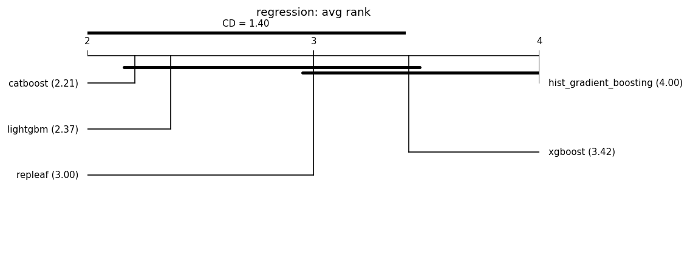

# Fair leaderboard (same-budget HPO)

Auto-generated by `benchmarks/leaderboard.py`. Every model is tuned with an **identical Optuna trial budget** on the same split and seed, then scored once on held-out test data. This replaces the earlier tuned-vs-default comparisons.

**Honest positioning:** under fair tuning RepLeafGBM is expected to be *competitive but not state-of-the-art on average*; its defensible support is in niche regimes (see the robust multi-output and router-extraction studies). No headline is claimed without a significance test, and null/negative results are reported alongside wins. **Model defaults are not changed here** — that requires a `results-analyst` report.

## Reproducibility manifest

- suite: grinsztajn_num_reg; seeds: [0, 1, 2, 3, 4, 5, 6, 7, 8, 9]; HPO trials/model: 50 (identical budget per model); max_rows: 20000
- split: 70%/15%/15% (Grinsztajn; train capped at 10k, stratified for classification); alpha=0.05; MRD=1% relative
- Equal trial count is the budget; it is **not** equal wall-clock.

## Regression (19 datasets)

### cpu_act

| model | rmse | r2 | fit[s] |
|---|---|---|---|
| repleaf | 2.2569 | 0.9851 | 2.3 |
| catboost | 2.2650 | 0.9851 | 0.9 |
| lightgbm | 2.2760 | 0.9850 | 10.5 |
| hist_gradient_boosting | 2.2826 | 0.9848 | 1.2 |
| xgboost | 2.3518 | 0.9835 | 1.1 |

### pol

| model | rmse | r2 | fit[s] |
|---|---|---|---|
| catboost | 3.8802 | 0.9913 | 4.7 |
| lightgbm | 4.0526 | 0.9905 | 26.3 |
| repleaf | 4.0893 | 0.9903 | 4.8 |
| xgboost | 4.1058 | 0.9902 | 1.6 |
| hist_gradient_boosting | 4.2732 | 0.9894 | 1.9 |

### elevators

| model | rmse | r2 | fit[s] |
|---|---|---|---|
| catboost | 0.0021 | 0.9064 | 3.6 |
| repleaf | 0.0021 | 0.9062 | 4.6 |
| xgboost | 0.0021 | 0.9005 | 0.7 |
| lightgbm | 0.0022 | 0.8994 | 10.9 |
| hist_gradient_boosting | 0.0022 | 0.8967 | 1.9 |

### wine_quality

| model | rmse | r2 | fit[s] |
|---|---|---|---|
| xgboost | 0.6051 | 0.5112 | 3.0 |
| lightgbm | 0.6082 | 0.5061 | 28.0 |
| catboost | 0.6086 | 0.5054 | 14.4 |
| repleaf | 0.6182 | 0.4896 | 5.8 |
| hist_gradient_boosting | 0.6188 | 0.4885 | 3.0 |

### Ailerons

| model | rmse | r2 | fit[s] |
|---|---|---|---|
| catboost | 0.0002 | 0.8595 | 12.7 |
| repleaf | 0.0002 | 0.8555 | 19.2 |
| lightgbm | 0.0002 | 0.8554 | 14.5 |
| hist_gradient_boosting | 0.0002 | 0.8531 | 4.8 |
| xgboost | 0.0002 | 0.8365 | 0.6 |

### houses

| model | rmse | r2 | fit[s] |
|---|---|---|---|
| lightgbm | 0.2204 | 0.8487 | 20.6 |
| xgboost | 0.2222 | 0.8461 | 3.9 |
| catboost | 0.2229 | 0.8450 | 10.0 |
| repleaf | 0.2233 | 0.8445 | 7.1 |
| hist_gradient_boosting | 0.2255 | 0.8414 | 5.2 |

### house_16H

| model | rmse | r2 | fit[s] |
|---|---|---|---|
| lightgbm | 0.6199 | 0.5199 | 8.9 |
| hist_gradient_boosting | 0.6213 | 0.5177 | 3.5 |
| repleaf | 0.6222 | 0.5164 | 10.1 |
| catboost | 0.6248 | 0.5121 | 11.7 |
| xgboost | 0.6294 | 0.5039 | 3.3 |

### diamonds

| model | rmse | r2 | fit[s] |
|---|---|---|---|
| repleaf | 0.2341 | 0.9468 | 6.0 |
| xgboost | 0.2351 | 0.9464 | 0.9 |
| lightgbm | 0.2353 | 0.9463 | 4.9 |
| hist_gradient_boosting | 0.2354 | 0.9463 | 0.8 |
| catboost | 0.2355 | 0.9462 | 9.2 |

### Brazilian_houses

| model | rmse | r2 | fit[s] |
|---|---|---|---|
| catboost | 0.0550 | 0.9943 | 2.2 |
| repleaf | 0.0606 | 0.9930 | 4.3 |
| xgboost | 0.0652 | 0.9922 | 0.7 |
| lightgbm | 0.0727 | 0.9906 | 12.7 |
| hist_gradient_boosting | 0.0778 | 0.9897 | 1.8 |

### Bike_Sharing_Demand

| model | rmse | r2 | fit[s] |
|---|---|---|---|
| catboost | 97.4813 | 0.7129 | 5.5 |
| lightgbm | 98.6778 | 0.7059 | 6.4 |
| xgboost | 98.7996 | 0.7051 | 0.5 |
| repleaf | 98.8661 | 0.7047 | 2.5 |
| hist_gradient_boosting | 98.9011 | 0.7044 | 1.0 |

### nyc-taxi-green-dec-2016

| model | rmse | r2 | fit[s] |
|---|---|---|---|
| lightgbm | 0.4071 | 0.5366 | 17.4 |
| catboost | 0.4090 | 0.5324 | 2.1 |
| repleaf | 0.4111 | 0.5276 | 9.3 |
| hist_gradient_boosting | 0.4137 | 0.5215 | 1.6 |
| xgboost | 0.4226 | 0.5006 | 0.5 |

### house_sales

| model | rmse | r2 | fit[s] |
|---|---|---|---|
| catboost | 0.1775 | 0.8879 | 10.2 |
| lightgbm | 0.1779 | 0.8874 | 14.3 |
| xgboost | 0.1784 | 0.8868 | 1.4 |
| hist_gradient_boosting | 0.1795 | 0.8853 | 2.2 |
| repleaf | 0.1800 | 0.8847 | 10.5 |

### sulfur

| model | rmse | r2 | fit[s] |
|---|---|---|---|
| catboost | 0.0194 | 0.8622 | 7.2 |
| hist_gradient_boosting | 0.0194 | 0.8648 | 1.9 |
| xgboost | 0.0195 | 0.8634 | 1.6 |
| lightgbm | 0.0198 | 0.8579 | 18.6 |
| repleaf | 0.0208 | 0.8451 | 4.9 |

### medical_charges

| model | rmse | r2 | fit[s] |
|---|---|---|---|
| repleaf | 0.0798 | 0.9801 | 1.6 |
| catboost | 0.0805 | 0.9797 | 2.6 |
| hist_gradient_boosting | 0.0807 | 0.9796 | 0.5 |
| lightgbm | 0.0809 | 0.9795 | 2.2 |
| xgboost | 0.0812 | 0.9794 | 0.2 |

### MiamiHousing2016

| model | rmse | r2 | fit[s] |
|---|---|---|---|
| catboost | 0.1421 | 0.9372 | 12.3 |
| lightgbm | 0.1442 | 0.9353 | 14.1 |
| xgboost | 0.1445 | 0.9351 | 2.3 |
| repleaf | 0.1462 | 0.9335 | 8.3 |
| hist_gradient_boosting | 0.1475 | 0.9323 | 2.3 |

### superconduct

| model | rmse | r2 | fit[s] |
|---|---|---|---|
| lightgbm | 9.8855 | 0.9163 | 22.0 |
| xgboost | 9.9077 | 0.9160 | 23.5 |
| hist_gradient_boosting | 9.9820 | 0.9147 | 15.1 |
| repleaf | 9.9909 | 0.9145 | 106.8 |
| catboost | 10.0180 | 0.9141 | 73.7 |

### yprop_4_1

| model | rmse | r2 | fit[s] |
|---|---|---|---|
| catboost | 0.0279 | 0.0978 | 21.8 |
| xgboost | 0.0280 | 0.0912 | 2.1 |
| lightgbm | 0.0280 | 0.0896 | 6.2 |
| hist_gradient_boosting | 0.0281 | 0.0844 | 2.5 |
| repleaf | 0.0281 | 0.0828 | 9.3 |

### abalone

| model | rmse | r2 | fit[s] |
|---|---|---|---|
| repleaf | 2.0952 | 0.5598 | 1.0 |
| lightgbm | 2.1071 | 0.5552 | 1.9 |
| hist_gradient_boosting | 2.1280 | 0.5461 | 0.6 |
| xgboost | 2.1320 | 0.5444 | 0.3 |
| catboost | 2.1427 | 0.5396 | 5.0 |

### delays_zurich_transport

| model | rmse | r2 | fit[s] |
|---|---|---|---|
| lightgbm | 3.0813 | 0.0297 | 1.4 |
| catboost | 3.0837 | 0.0281 | 2.0 |
| repleaf | 3.0840 | 0.0280 | 1.9 |
| hist_gradient_boosting | 3.0857 | 0.0269 | 0.5 |
| xgboost | 3.0862 | 0.0266 | 0.2 |

### Aggregate — regression

Friedman chi-square = 16.716, p = 0.00219 (models differ at alpha=0.05).

Critical difference (Nemenyi, CD = 1.399); lower average rank = better.

| place | model | avg rank |
|---|---|---|
| 1 | catboost | 2.211 |
| 2 | lightgbm | 2.368 |
| 3 | repleaf | 3.000 |
| 4 | xgboost | 3.421 |
| 5 | hist_gradient_boosting | 4.000 |

Groups **not** significantly different (avg-rank span <= CD):
- {catboost, lightgbm, repleaf, xgboost}
- {repleaf, xgboost, hist_gradient_boosting}

Baseline for pairwise tests: **catboost** (best average rank). A model is **bold** when it beats the baseline with Wilcoxon p < 0.05 **and** by more than the MRD (1% relative).

| model | avg rank | Wilcoxon p vs base | median delta | win/tie/loss | verdict |
|---|---|---|---|---|---|
| catboost (baseline) | 2.21 | - | - | - | - |
| lightgbm | 2.37 | 0.829 | +0.0001 | 3/9/7 | not sig. |
| repleaf | 3.00 | 0.374 | +0.0003 | 1/10/8 | not sig. |
| xgboost | 3.42 | 0.0955 | +0.0008 | 1/10/8 | not sig. |
| hist_gradient_boosting | 4.00 | 0.0446 | +0.0020 | 0/9/10 | not sig. |

