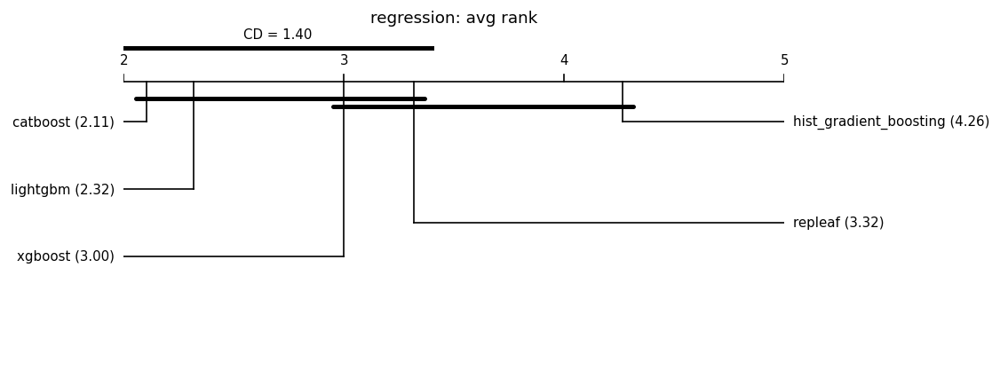

# Fair leaderboard (same-budget HPO)

Auto-generated by `benchmarks/leaderboard.py`. Every model is tuned with an **identical Optuna trial budget** on the same split and seed, then scored once on held-out test data. This replaces the earlier tuned-vs-default comparisons.

**Honest positioning:** under fair tuning RepLeafGBM is expected to be *competitive but not state-of-the-art on average*; its defensible support is in niche regimes (see the robust multi-output and router-extraction studies). No headline is claimed without a significance test, and null/negative results are reported alongside wins. **Model defaults are not changed here** — that requires a `results-analyst` report.

## Reproducibility manifest

- run_id: 20260626T024858Z; git: f6dc44a (dirty=True)
- python: 3.11.1 on macOS-26.5.1-arm64-arm-64bit
- OMP_NUM_THREADS: 1
- packages: numpy=1.23.5, pandas=1.5.2, scipy=1.10.0, scikit-learn=1.2.0, repleafgbm=0.0.1, optuna=4.6.0, lightgbm=4.6.0, xgboost=3.2.0, catboost=1.2.10, matplotlib=3.6.2
- suite: grinsztajn_num_reg; seeds: [0, 1, 2, 3, 4]; HPO trials/model: 50 (identical budget per model); max_rows: 20000
- split: 70%/15%/15% (Grinsztajn; train capped at 10k, stratified for classification); alpha=0.05; MRD=1% relative
- Equal trial count is the budget; it is **not** equal wall-clock.

## Regression (19 datasets)

### cpu_act

| model | rmse | r2 | fit[s] |
|---|---|---|---|
| catboost | 2.3188 | 0.9850 | 0.6 |
| lightgbm | 2.3465 | 0.9846 | 2.8 |
| repleaf | 2.3754 | 0.9840 | 1.6 |
| hist_gradient_boosting | 2.3949 | 0.9837 | 0.9 |
| xgboost | 2.5315 | 0.9813 | 0.9 |

### pol

| model | rmse | r2 | fit[s] |
|---|---|---|---|
| catboost | 3.9001 | 0.9913 | 4.2 |
| xgboost | 4.0277 | 0.9907 | 1.8 |
| lightgbm | 4.0459 | 0.9906 | 5.4 |
| repleaf | 4.1118 | 0.9903 | 3.4 |
| hist_gradient_boosting | 4.2406 | 0.9897 | 1.4 |

### elevators

| model | rmse | r2 | fit[s] |
|---|---|---|---|
| catboost | 0.0021 | 0.9088 | 0.7 |
| repleaf | 0.0021 | 0.9063 | 1.6 |
| xgboost | 0.0021 | 0.9036 | 0.3 |
| lightgbm | 0.0022 | 0.9022 | 2.5 |
| hist_gradient_boosting | 0.0022 | 0.8988 | 0.8 |

### wine_quality

| model | rmse | r2 | fit[s] |
|---|---|---|---|
| xgboost | 0.6078 | 0.5052 | 1.4 |
| lightgbm | 0.6132 | 0.4962 | 8.3 |
| catboost | 0.6142 | 0.4946 | 2.9 |
| repleaf | 0.6230 | 0.4799 | 3.0 |
| hist_gradient_boosting | 0.6236 | 0.4788 | 1.2 |

### Ailerons

| model | rmse | r2 | fit[s] |
|---|---|---|---|
| catboost | 0.0002 | 0.8581 | 1.7 |
| lightgbm | 0.0002 | 0.8541 | 5.2 |
| hist_gradient_boosting | 0.0002 | 0.8523 | 1.9 |
| repleaf | 0.0002 | 0.8523 | 11.7 |
| xgboost | 0.0002 | 0.8358 | 0.3 |

### houses

| model | rmse | r2 | fit[s] |
|---|---|---|---|
| lightgbm | 0.2204 | 0.8488 | 6.3 |
| xgboost | 0.2229 | 0.8453 | 1.4 |
| catboost | 0.2231 | 0.8449 | 1.5 |
| repleaf | 0.2234 | 0.8446 | 2.1 |
| hist_gradient_boosting | 0.2264 | 0.8404 | 1.0 |

### house_16H

| model | rmse | r2 | fit[s] |
|---|---|---|---|
| lightgbm | 0.6175 | 0.5220 | 3.3 |
| xgboost | 0.6209 | 0.5163 | 0.9 |
| catboost | 0.6253 | 0.5098 | 1.4 |
| repleaf | 0.6258 | 0.5086 | 1.6 |
| hist_gradient_boosting | 0.6292 | 0.5033 | 1.0 |

### diamonds

| model | rmse | r2 | fit[s] |
|---|---|---|---|
| repleaf | 0.2334 | 0.9466 | 0.8 |
| xgboost | 0.2342 | 0.9462 | 0.2 |
| hist_gradient_boosting | 0.2343 | 0.9462 | 0.3 |
| lightgbm | 0.2343 | 0.9462 | 1.2 |
| catboost | 0.2346 | 0.9460 | 1.5 |

### Brazilian_houses

| model | rmse | r2 | fit[s] |
|---|---|---|---|
| catboost | 0.0473 | 0.9959 | 0.6 |
| xgboost | 0.0593 | 0.9941 | 0.3 |
| repleaf | 0.0595 | 0.9937 | 1.8 |
| hist_gradient_boosting | 0.0689 | 0.9923 | 0.6 |
| lightgbm | 0.0730 | 0.9913 | 4.3 |

### Bike_Sharing_Demand

| model | rmse | r2 | fit[s] |
|---|---|---|---|
| catboost | 97.6369 | 0.7118 | 1.3 |
| lightgbm | 98.8217 | 0.7048 | 2.4 |
| xgboost | 98.8957 | 0.7043 | 0.2 |
| repleaf | 98.9922 | 0.7037 | 0.5 |
| hist_gradient_boosting | 99.0201 | 0.7035 | 0.4 |

### nyc-taxi-green-dec-2016

| model | rmse | r2 | fit[s] |
|---|---|---|---|
| lightgbm | 0.4044 | 0.5395 | 5.5 |
| catboost | 0.4057 | 0.5366 | 0.8 |
| hist_gradient_boosting | 0.4101 | 0.5265 | 1.3 |
| repleaf | 0.4104 | 0.5257 | 3.2 |
| xgboost | 0.4201 | 0.5033 | 0.3 |

### house_sales

| model | rmse | r2 | fit[s] |
|---|---|---|---|
| catboost | 0.1786 | 0.8882 | 2.0 |
| lightgbm | 0.1791 | 0.8876 | 4.7 |
| xgboost | 0.1795 | 0.8872 | 0.6 |
| repleaf | 0.1811 | 0.8851 | 4.4 |
| hist_gradient_boosting | 0.1813 | 0.8848 | 1.0 |

### sulfur

| model | rmse | r2 | fit[s] |
|---|---|---|---|
| catboost | 0.0181 | 0.8830 | 1.7 |
| xgboost | 0.0185 | 0.8824 | 0.8 |
| lightgbm | 0.0185 | 0.8810 | 7.8 |
| hist_gradient_boosting | 0.0190 | 0.8746 | 0.9 |
| repleaf | 0.0193 | 0.8707 | 1.5 |

### medical_charges

| model | rmse | r2 | fit[s] |
|---|---|---|---|
| repleaf | 0.0783 | 0.9810 | 0.6 |
| hist_gradient_boosting | 0.0793 | 0.9805 | 0.2 |
| catboost | 0.0793 | 0.9805 | 0.7 |
| lightgbm | 0.0797 | 0.9803 | 1.2 |
| xgboost | 0.0799 | 0.9802 | 0.1 |

### MiamiHousing2016

| model | rmse | r2 | fit[s] |
|---|---|---|---|
| catboost | 0.1420 | 0.9375 | 2.0 |
| lightgbm | 0.1443 | 0.9356 | 5.8 |
| xgboost | 0.1446 | 0.9352 | 0.9 |
| repleaf | 0.1459 | 0.9340 | 2.3 |
| hist_gradient_boosting | 0.1481 | 0.9321 | 0.9 |

### superconduct

| model | rmse | r2 | fit[s] |
|---|---|---|---|
| lightgbm | 9.8673 | 0.9172 | 12.1 |
| repleaf | 9.9112 | 0.9164 | 21.1 |
| xgboost | 9.9177 | 0.9164 | 15.6 |
| catboost | 9.9888 | 0.9152 | 20.3 |
| hist_gradient_boosting | 9.9963 | 0.9150 | 7.3 |

### yprop_4_1

| model | rmse | r2 | fit[s] |
|---|---|---|---|
| catboost | 0.0290 | 0.0954 | 3.9 |
| xgboost | 0.0290 | 0.0942 | 0.8 |
| lightgbm | 0.0291 | 0.0899 | 2.1 |
| hist_gradient_boosting | 0.0292 | 0.0837 | 1.5 |
| repleaf | 0.0293 | 0.0770 | 1.5 |

### abalone

| model | rmse | r2 | fit[s] |
|---|---|---|---|
| lightgbm | 2.1137 | 0.5465 | 1.5 |
| repleaf | 2.1180 | 0.5444 | 0.2 |
| xgboost | 2.1539 | 0.5289 | 0.1 |
| hist_gradient_boosting | 2.1579 | 0.5269 | 0.3 |
| catboost | 2.1675 | 0.5226 | 0.9 |

### delays_zurich_transport

| model | rmse | r2 | fit[s] |
|---|---|---|---|
| lightgbm | 3.0667 | 0.0332 | 0.6 |
| catboost | 3.0673 | 0.0328 | 0.7 |
| repleaf | 3.0678 | 0.0325 | 0.6 |
| xgboost | 3.0709 | 0.0306 | 0.1 |
| hist_gradient_boosting | 3.0713 | 0.0303 | 0.2 |

### Aggregate — regression

Friedman chi-square = 22.526, p = 0.000157 (models differ at alpha=0.05).

Critical difference (Nemenyi, CD = 1.399); lower average rank = better.

| place | model | avg rank |
|---|---|---|
| 1 | catboost | 2.105 |
| 2 | lightgbm | 2.316 |
| 3 | xgboost | 3.000 |
| 4 | repleaf | 3.316 |
| 5 | hist_gradient_boosting | 4.263 |

Groups **not** significantly different (avg-rank span <= CD):
- {catboost, lightgbm, xgboost, repleaf}
- {xgboost, repleaf, hist_gradient_boosting}

Baseline for pairwise tests: **catboost** (best average rank). A model is **bold** when it beats the baseline with Wilcoxon p < 0.05 **and** by more than the MRD (1% relative).

| model | avg rank | Wilcoxon p vs base | median delta | win/tie/loss | verdict |
|---|---|---|---|---|---|
| catboost (baseline) | 2.11 | - | - | - | - |
| lightgbm | 2.32 | 0.829 | +0.0001 | 4/7/8 | not sig. |
| xgboost | 3.00 | 0.21 | +0.0004 | 1/9/9 | not sig. |
| repleaf | 3.32 | 0.0546 | +0.0005 | 2/6/11 | not sig. |
| hist_gradient_boosting | 4.26 | 0.00202 | +0.0039 | 0/7/12 | not sig. |

